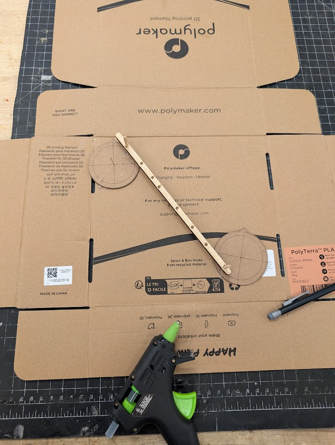

# Liv's Design Journal

Hello and welcome to my design journal. Hopefully this will be a clear representation of everything I have been doing throughout TDF during Fall 2025 and will be an enjoyable read!

I have divided this into a few sections:
1. [The Arduino](#arduino)
2. [Laser Cutter](#laser-cutter)
3. [3D Printing](#3d-printing)
4. [Emotive Origami](#origami)


 <div id="arduino"></div>

## The Arduino

### Semester week 2
Never have I ever touched an arduino. Nope. This is so true. So I must admit I was a bit intimidated when we first got our kits filled with electronics. But all the guides were super useful (except for the fact that I hadn't realised I had to load my code to the arduino so I kept pressing run and nothing happened). Finally, I realised I had to do that and magical things started happening!

First off, my arduino came with Blink loaded so as soon as I connected it, it was doing its thing (I thought it might be an error message but no, it was just blink - thank you google for answering my questions).

So step one was forcing off the light:
```arduino
void setup() {
 
  // do nothing except force 13 led off
  pinMode(13, OUTPUT);
  digitalWrite(13, LOW);
}
void loop() {
}
```

Crazy stuff, I know. 

So then we got to make the light blink:
```arduino
int led = 13;  // define a variable to hold the pin number of the internal LED

// the setup function runs once when you press reset or power the board
void setup() {
  // initialize digital pin LED_BUILTIN as an output.
  pinMode(led, OUTPUT);
}

// the loop function runs over and over again forever
void loop() {
  digitalWrite(led, HIGH);   // turn the LED on (HIGH is the voltage level)
  delay(1000);                       // wait for a second
  digitalWrite(led, LOW);    // turn the LED off by making the voltage LOW
  delay(1000);                       // wait for a second
}
```

And I connected an LED to it!


Proceeded to try changing it to pin 8 and then pin 8 and 13 alternatingly! (not all code is included here as they are just variations of each other but it can be found on the github folder this markdown belongs to)

```arduino
int led = 13;  // define a variable to hold the pin number of the internal LED
int ledext = 8;
// the setup function runs once when you press reset or power the board
void setup() {
  // initialize digital pin LED_BUILTIN as an output.
  pinMode(led, OUTPUT);
  pinMode(ledext, OUTPUT);
}

// the loop function runs over and over again forever
void loop() {
  digitalWrite(led, HIGH);   // turn the LED on (HIGH is the voltage level)
  digitalWrite(ledext, LOW);
  delay(1000);                       // wait for a second
  digitalWrite(led, LOW);    // turn the LED off by making the voltage LOW
  digitalWrite(ledext, HIGH);
  delay(1000);                       // wait for a second
}
```

You can see the video here: https://photos.app.goo.gl/9VgwX1SNipQTziiv8
________________________________________________________________________
Homework for this week:
- Write  a program to flash the onboard LED while printing Hello World to serial

```arduino
int led = 13;  // define a variable to hold the pin number of the internal LED

void setup() {
  // put your setup code here, to run once:

  // initialize digital pin LED_BUILTIN as an output.
  pinMode(led, OUTPUT);
  Serial.begin(9600);
}

void loop() {
  // put your main code here, to run repeatedly:
//send 'Hello, world!' over the serial port
  Serial.println("Hello, world!");
  delay(1000);
  digitalWrite(led, HIGH);   // turn the LED on (HIGH is the voltage level)
  delay(1000);                       // wait for a second
  digitalWrite(led, LOW);    // turn the LED off by making the voltage LOW
  delay(1000);                       // wait for a second
}
```

- Make “something interesting” happen with:

1 LEDs + 1 LDR
2 or more LEDs

Ok Sudhu, an open-ended exercise... it's always tough to just try something out with a new medium BUT let me think of something.

So I knew what an LED was but not an LDR (the abbreviation at least). My first step was to test it out. I didn't change my resistor like it was indicated on Sudhu's github page on arduinos but it still worked and made me understand what this magical new tool does (refer to video link below). I used the flashlight on my phone to shed even more light on the resistor and got it up to 41 I believe. 

You can see the video here:
https://photos.app.goo.gl/dGQg98hR28bRwcBfA

So now I am home, after doing all these things during Sudhu's lesson and being exceedingly proud of myself (image evidence below).

Yep, it went on the family groupchat :)


So I tested out the examples you had up, this is one of them: https://photos.app.goo.gl/qhkP5B8pzVw5FaAp8

I think I want to do something that reads an input from the LDR and tells you how bright a 'room' is depending on the value. I drew this out, having the LEDs in parallel. I used gemini to help me create this code but it needed troubleshooting anyway:

```arduino

// Define the pins for your colored LEDs
const int ldrPin = A0;
const int redLedPin = 2;    // For "pitch black"
const int yellowLedPin = 3; // For "ambient"
const int greenLedPin = 4;  // For "super bright"


// Use the Serial Monitor to find the best numbers.
// More light = lower LDR value.
const int brightThreshold = 250; // above this value, it's bright
const int darkThreshold = 150;   // below this value, it's pitch black

void setup() {
  // Set all LED pins as outputs
  pinMode(redLedPin, OUTPUT);
  pinMode(yellowLedPin, OUTPUT);
  pinMode(greenLedPin, OUTPUT);
  
  // Start serial communication so you can find your threshold values
  Serial.begin(9600); 
}

void loop() {
  // Read the value from the LDR sensor
  int ldrValue = analogRead(ldrPin);
  
  // Print the current light value to help you calibrate
  Serial.print("LDR Value: ");
  Serial.println(ldrValue); 
  
  // Logic to turn on the correct LED
  if (ldrValue > brightThreshold) { // Super bright conditions
    digitalWrite(greenLedPin, HIGH);
    digitalWrite(yellowLedPin, LOW);
    digitalWrite(redLedPin, LOW);
  } 
  else if (ldrValue < darkThreshold) { // Pitch black conditions
    digitalWrite(greenLedPin, LOW);
    digitalWrite(yellowLedPin, LOW);
    digitalWrite(redLedPin, HIGH);
  } 
  else { // Ambient light (in between bright and dark)
    digitalWrite(greenLedPin, LOW);
    digitalWrite(yellowLedPin, HIGH);
    digitalWrite(redLedPin, LOW);
  }
  
  delay(100); // A small delay for stability
}

```
So I had tested in the previous exercise what the brightness output was when in my ambient (200ish), if I put my finger over it (100ish) and if I shined a light on it (600 to 800) so I knew I had to make those my threshold values.

Video here: https://photos.app.goo.gl/CKZZgYVm32XcnNbw9

Annnndddddd so now I wanted to try and combine the two and make it dim or not depending on how bright it is and also change colours for different thresholds.

This is a pic of the circuit for the lights:


LLMs are useful because when things don't work, you can usually get help: "Move the LEDs to PWM-capable pins. On most Arduino boards, these are marked with a tilde (~).".

So great, we figured that out. Let's try again.

```arduino
const int ldrPin = A0;
const int redLedPin = 9; 
const int yellowLedPin = 10;
const int greenLedPin = 11;  

// --- CALIBRATION THRESHOLDS ---
// More light = higher LDR value.
const int brightThreshold = 150;
const int darkThreshold = 550;

void setup() {
  // Set all LED pins as outputs
  pinMode(redLedPin, OUTPUT);
  pinMode(yellowLedPin, OUTPUT);
  pinMode(greenLedPin, OUTPUT);

  Serial.begin(9600); 
}

void loop() {
  // Read the value from the LDR sensor
  int ldrValue = analogRead(ldrPin);
  
  // Print value
  Serial.println(ldrValue); 
  
  // Logic to turn on the correct LED with variable brightness
  if (ldrValue < brightThreshold) { // Super bright conditions
    // The GREEN LED gets brighter as the light increases (ldrValue goes up)
    int brightness = map(ldrValue, brightThreshold, 0, 0, 255);
    analogWrite(redLedPin, brightness);
    analogWrite(yellowLedPin, 0); // Turn other LEDs off
    analogWrite(greenLedPin, 0);
  } 
  else if (ldrValue > darkThreshold) { // Pitch black conditions
    // The RED LED gets brighter as it gets darker (ldrValue decreases)
    int brightness = map(ldrValue, darkThreshold, 1023, 0, 255);
    analogWrite(greenLedPin, brightness);
    analogWrite(redLedPin, 0); // Turn other LEDs off
    analogWrite(yellowLedPin, 0);
  } 
  else { // Ambient light (in between bright and dark)
    // The YELLOW LED fades in and out within the ambient range
    int brightness = map(ldrValue, brightThreshold, darkThreshold, 0, 255);
    analogWrite(yellowLedPin, brightness);
    analogWrite(greenLedPin, 0); // Turn other LEDs off
    analogWrite(redLedPin, 0);
  }
  
  delay(10); // A smaller delay for smoother transitions
}

```


I had to edit the code as I had a pull down, not a pull up resistor. 

BUT WE GOT THERE: TADAAAAAA https://photos.app.goo.gl/VDqCrcfi39f5Pdtu9

We did it! I think I understand this whole jazz a bit better now. And in the end, you really need to understand what you are doing in order to set it up correctly aand be able to troubleshoot. I liked that we got to play around with it and just figure it out.

### Semester week 3

RGB Lights. A great invention, in my opinion. However, a bit odd looking!

First thing is first, why does red need a higher resistor?

I connected it to the circuit and at first it did not work because I built the circuit wrong by connecting my pins to a different side of the breadbord than my LEDs. But then, it worked!

It blinked: https://photos.app.goo.gl/wBuv5ETHRRv4dRo49
It faded: https://photos.app.goo.gl/UwmGn9u67qNqHSXb7
And it even faded with some different colours: https://photos.app.goo.gl/LsGbfzP4DooMuMWT7

Pretty cool, huh?

The next few things I did were kinda following the tutorial to get familiar with the different components, how they work, and what they do.

So I had my RGB connected, and it was such a pain to do it that I did not want to disconnect it. Instead, I just connected the button to the circuit and tested it out with the output from only one pin from the arduino, essentially treating it like a blue LED. 

It was a bit weird to understand how the button worked since the example button on the github tutorial has 4 pins and ours only have two. Nevertheless, I eventually figured it out because it had to break the circuit somehow. 

So yay, the button worked: https://photos.app.goo.gl/cX7znGTYjLBT39QC9

Now, I wanted to see if I could make it cycle through red, green, and blue. 

I tried finding some example code online but none of them worked for me. I then tried building the logic but didn't know how to make them change depending on how many times the button was pressed. 

So I had this:

```arduino

// Define the pins for the RGB LED and the button
const int redPin = 11;
const int greenPin = 10;
const int bluePin = 9;
const int buttonPin = 2;

// variables will change:
int buttonState = 0;         // variable for reading the pushbutton status
int buttonCount = 0;
void setup() {
  // Set the LED pins as outputs
  pinMode(redPin, OUTPUT);
  pinMode(greenPin, OUTPUT);
  pinMode(bluePin, OUTPUT);

  // Set the button pin as an input
  pinMode(buttonPin, INPUT);
}

void loop() {
  // read the state of the pushbutton value:
  buttonState = digitalRead(buttonPin);


  // check if the pushbutton is pressed. If it is, the buttonState is HIGH:
  if (buttonState == HIGH & buttonCount = 0) {
    // turn red LED on:
    digitalWrite(redPin, HIGH);
    digitalWrite(greenPin, LOW);
    digitalWrite(bluePin, LOW);
    buttonCount++;
  }

  else if (buttonState == HIGH & buttonCount = 1) {
    // turn green LED on:
    digitalWrite(redPin, LOW);
    digitalWrite(greenPin, HIGH);
    digitalWrite(bluePin, LOW);
    buttonCount++;
  }
  
  else if (buttonState == HIGH & buttonCount = 2) {
    // turn blue LED on:
    digitalWrite(redPin, LOW);
    digitalWrite(greenPin, LOW);
    digitalWrite(bluePin, HIGH);
    buttonCount++;
  }

else if (buttonState == HIGH & buttonCount = 3) {
    // turn off all LEDs:
    digitalWrite(redPin, LOW);
    digitalWrite(greenPin, LOW);
    digitalWrite(bluePin, LOW);
    buttonCount = 0;
  }
}

```

But that did not work and gave me the error "Compilation error: lvalue required as left operand of assignment".

So I went over to Gemini to ask what was wrong as I could ont figure it out. Well, it makes sense but was a bit annoying: "You have repeated the most common mistake that causes this type of error: using a single equals sign (=) for comparison when you should be using a double equals sign (==)."

So I fixed that. and it still did not work. I mean, the code ran but the light was doing some wacky stuff. I think both I and the arduino were unsure of what was going on. So back I actually tried reading through the code to figure out where my logic was wrong. Lo and behold, I found it. Every time I press the button, it will be high, and run the first code of block and immediately run the second, third... so basically it'll just run through all the colours and tur off. So I need a way to make the loop trigger only when the button is pressed and for me to know when it is first pressed so I can start the counter. 

And this is the not very elegnt solution:

```arduino
// Define the pins for the RGB LED and the button
const int redPin = 11;
const int greenPin = 10;
const int bluePin = 9;
const int buttonPin = 2;

// Variables to store state
int buttonCount = 0;
int lastButtonState = LOW; // Variable to track the last known button state

void setup() {
  // Set the LED pins as outputs
  pinMode(redPin, OUTPUT);
  pinMode(greenPin, OUTPUT);
  pinMode(bluePin, OUTPUT);

  // Set the button pin as an input
  pinMode(buttonPin, INPUT);
  
}

void loop() {
  // Read the current state of the button
  int currentButtonState = digitalRead(buttonPin);

  // Check if the button was just pressed (transitioned from LOW to HIGH)
  if (currentButtonState == HIGH & lastButtonState == LOW) {
    
    // Increase counter on press
    buttonCount++;

    // Cycle the light based on the new count
    if (buttonCount == 1) {
      // Turn red on
      digitalWrite(redPin, HIGH);
      digitalWrite(greenPin, LOW);
      digitalWrite(bluePin, LOW);
    } else if (buttonCount == 2) {
      // Turn green on
      digitalWrite(redPin, LOW);
      digitalWrite(greenPin, HIGH);
      digitalWrite(bluePin, LOW);
    } else if (buttonCount == 3) {
      // Turn blue on
      digitalWrite(redPin, LOW);
      digitalWrite(greenPin, LOW);
      digitalWrite(bluePin, HIGH);
    } else {
      digitalWrite(redPin, LOW);
      digitalWrite(greenPin, LOW);
      digitalWrite(bluePin, LOW);
      buttonCount = 0; // Reset
    }
  }
  lastButtonState = currentButtonState;
}
```

So I went to Gemini and asked how I could do this. Well, I learned about the difference in & and && operators in C++ because it told me off for using a bitwise AND (not that I even knew what that was before today). Glad to know && is my logical AND operator. I digress. I also learned that part of the issue I was having with my code (sometimes it would jump two colours at once) is because of something called bouncing (which meant my counter was going up when I did not intend for it to register my press). 

You can see the code it gave me [here.](/Arduino/TDF%202025/week%203/rgb_cycle_button_press_Gemini/rgb_cycle_button_press_Gemini.ino)

I learned you can have case switches which is pretty cool. It definitely made the code look cleaner!

So next up were Potentiometers, which is a fancy way of saying it's a variable resistor. I wanted to understand how it worked and this video was pretty clear: https://www.youtube.com/watch?v=sWbSeJmUFfw. It is actually part of the reason I managed to debug my Servo set up later on in this exercise. 

Here is the potentiometer in action: https://photos.app.goo.gl/gJFR91XgGTXid7C4A

With an LED attached: https://photos.app.goo.gl/gJFR91XgGTXid7C4A and https://photos.app.goo.gl/wfhJ3e1xYx6J7Uhu7

Here is the Servo in action: https://photos.app.goo.gl/9YQyDrByBVSNtXyc6

I forgot to film the potentiometer serving as a knob for it but I also did that. 

However, I tried making it so the delay would be mapped onto the potentiometer in order to make the potentiometer change the sweep speed and failed. I can't think of how to structure the code exactly. I'll ask about it in class!

You can see all of this week's arduino code [here.](./Arduino/TDF%202025/week%203)

### Semester week 4

This week we are focusing on servos and sensors. The sensor we are familiar with by now is the LDR. This week, the ultrasonic sensor and PIR sensors were introduced.

We also learned how to load custom libraries into Arduino's IDE which is super helpful since there are many programmers before us who have converted complicated things into simple fubnctions with their libraries - I am very thankful.

In class, we worked on making the ultrasonic sensor control the servo's position. We used the Ultrasonic Library by Erick Simoes and it worked: https://photos.app.goo.gl/rn3gAfLQwx8U8hZG7 !!!

Next up, I tried out the PIR sensor which I thought looked cuter and more discrete. I used it as a trigger for an LED to test it.

That video is here: https://photos.app.goo.gl/t1vsbjCqyVEhZ9cv7

After getting very excited about seeing that happen, I decided it was time to try connecting it to the servo.

And when the PIR detected movement, the servo would move to 90 degrees and once there was no movement, it would go back to 0. 

This week, we have our first project (emotive origami) and I figured that the PIR would be great for that as I want the program to be motion activated. I do not plan on mapping any values to alter how the servo reacts to motion at different distances or anything like that so this PIR sensor seems suitable. Plus, it's passive whch I thought was cool as it's not really consuming much energy unless it senses movement. 

All of my exploration for the origami section with servos and sensors can be found in the origami tab.


 <div id="laser-cutter"></div>

## Laser Cutters

### Semester Week 2

Week 1 with Chris... the topic? lasers. Automatically, cool. 

I've had so many laser cutting trainings but I had never actually gotten my hands dirty without supervision - it felt like a lot of responsibility. It was great to see the process shown in a clear yet simple way. I have now requested the "Manufacturing Processes for design professionals" on loan from the library (it was too expensive to buy). 

Thank you for the demo during class, it came in very handy.

I first had to think whether I wanted to do a cause I believed in or a personality thing. Recently, I have been thinking about my identity - it is a slightly turbulent topic for me because it is so all over the place (gegraphically and culturally). One of the roots of this is because I have lived in 4 different countries and I identify with a lot of parts of each culture. For this assignment, I thought I could tackles this and make a statement that I carry part of all of them with me!

So I started trying to come up with some ideas:


I setlled on wanting to represent my different roots but also do something that could teach me how to raster, engrave, and cut. This was perfect. 

I love animals and am passionate about having sanctuaries instead of zoos, and adoption in general for any kind of pet. 

So animals and countries (sounds like a 1st grade book title).

Courtesy of Gemini (notice the eiffel tower in Russia, Asia in Grreenland, two Australias and the US as Africa among other things)


So I found images of animals online and trying to image trace them. Some image traces were bad so I started playing with the different setting. Outline worked well, black and white logo for some things and certain images worked better than others. 


I measured the circumference of my fingers roughly with string and a ruler and divided by pi. 

Oh, and then converted to inches because I'm holding onto my metric girly title like it's my life.

After working out some kinks with adobe illustrator (arguably, the worse AI), I started learning some shortcuts and became a wizard (in comparison to how slow I was at the start). I also determined the ring's thickness would be 2mm because I forgot that laser + close together lines is bad.

So this was the first sketch:


I went to print, did everything correctly:


But this came out:


So clearly my outer and inner diameter difference of 2mm was too little and I also could have made sure my print properly fit in the area I wanted to print so I didn't just throw the laser on the bed. I started pointing my laser after this to the most extreme edges to make sure the plywood was not already cut in that area.

I widened the diameters, and tried printing again. 


This time, the width was better but some of my circles were not centered. I tried wearing them and the horse and bear rings were too wide. Additionally, the connections between these animals and the ring were too thin and they easily broke off.

Therefore, I widened the connections, ensured the radius difference was consistent and that the circles were centered. At this point I also did a Chris and forgot to select the material so had to do two passes.

Ta-da:


Some circles were still not super centered and the horse connection was too weak. 

So again, I tried BUT THIS TIME IT WORKED:


I sanded it and these were the rings I ended up making:


 <div id="3d-printing"></div>

 ## 3D Printing
### Semester Week 3

This week, our theme with Chris was 3D printing. We had to print our laser cut rings and then design a 3d ring. 

I chose to 3d print the toucan ring as it has a lot of fine detail that would not be suitable for 3d printing. I imported it into fusion as an svg, extruded the body downward and the details upward, sliced it in prusa and 3d printed it on one of the prusa 3s in the JAcob's Makerspace. 

It actually came out so much better than I originaly expected. The printer is really good. Also, since the plywood was flat and I didn't have any overhangs or anything, it actually did not need supports. 


It was not perfect by any means, and the resolution of the details were low but still impressive. The skirt was a bit hard to take off (you can see some of it in the picture).

I wanted to challenge myself and do something different for the ring. I had some experience with fusion but not loads. After having way too many opttions of what to do, I decided I wanted some sort of cool mechanism. I had some gummy bear pendants around and decided I would use it. The colours can represent my bisexuality as well which serves the personality theme of the assignment. Plus, it has some whimsy. 

My partner is extremely good at fusion so I knew that if I got stuck or didn't know how to do something, I could ask him for help.

The mechanism I wanted would work something like this but internally: https://www.youtube.com/watch?v=fGv8D-E9sgI

The idea was that it could also be an ear-ring... get it?

So once you attach it, it's a double bear ring but unlocked, you could make it into an earring. 

Here are some drawings:

  

My partner helped me figure out how the locking mechanism could work well and flexibly (he suggested a longer notch could be useful to avoid it from being really loose).

So onto fusion! The first sketch looked a lot like what was on the paper. I used a revolve to get the basic shape down. At first, I had the notch being 180 degrees but that seemed a bit excessive. Instead, they are now 90 degrees instead which is much nicer.

He also showed me how I can set a tolerance parameter and just apply it everywhere and how constraints can help in the sektch process.


So I revolved the different components as I said and added some fillets. I knew the supports might be a pain but I liked the design so YOLO.

After making the first body, I remembered I had to add a place to attach the bears with some wire I have at home. I used digital callipers to measure the thickness of the wire (which actually had a lot of variation). The average thickness was 0.98mm so I made the hole 1.2 which I thought would give it enough clearance. 

This is it before I added that bit:


And after:


Added some fillets to avoid scratching against my skin and mirrored them to see if they would actually work as intended in theory:


And so I thought I was ready to give printing it a try. I sliced it in prusa slicer and this time printed it in the mdes studio on a prusamk4s.

Version 1:


And I had intended to make the diameter of the ring 18mm. I built a construction line of 18mm from the Z axis and revolved around that. Which would obviously make 18mm the radius. So the first print was HUGE. 

I then tried scaling it down on the prusa software to an 18mm diameter and printed it. It was super small and the tolerances I needed were all off and clearly that did not work. 

Version 2:


So I had to launch fusion again (dreadful, I know). I adjusted that construction line to 9mm (you can see that in the fusion sketch above). 

And I printed Version 3:


Finally, I could test whether the hole was big enough for the wire. It was not.

So back to fusion again. I made the diameter of the hole for the wire 1.5mm now. It worked!

Now I had to clean the supports and see if the mechanism worked. I enlisted my partner to help with support cleaning because they were tough supports to take out. Even after cleaning as much as we could, the mechanism still would not work. Other tolerances worked fine, the rings stacked onto each other nicely but the rails where they slide on to lock had too small of a tolerance. As you can see in the picture, they aren't staying on the rail and are sitting not straight when you twist it.

Version 4:


So I doubled the tolerances on the rails and tried reprinting the ring. I also wanted to see if I could change the settings of the supports to make them easier to remove.

The grid setting for the supports instead of the automatic "snug" it selects definitely made removing supports easier. I also tried to decrease the amount of supports and I think it worked. 

The new ring worked! Maybe the clearances were a bit much now. So I tried reducing the clearance a bit again but it was too tight. So my final version had this higher tolerance [(it is this file.)](./3d%20printing/Olivia%20bear%20ring%20v5.stl)


Here is the final print with the grid supports:


And with the bears attached: 

And it in "earring mode": 

Although I am not super happy with the aesthetics, I did like the idea and maybe if I sanded and painted the rings, it would look better. Nevertheless, I am quite happy with the final outcome.

 <div id="origami"></div>
 
## Emotive Origami

### Semester Week 4

こんにちは (konichiwa)!

Welcome to my first TDF project. 

When Chris explained what the project entailed I felt quite intimidated and scared because I was not sure my building blocks from the past few weeks in arduino would be enough to create this.

So I tried to take it step by step. On Thursday evening, after a very stressful day, I decided to go out for dinner instead of cooking at home wit my partner. I took some paper with me and we both started folding the paper and playing with it to get some inspiration. The restaurant had some umbrellas (pictured below) which inspired one of the folds!


The videos of all the folds are here: https://photos.app.goo.gl/5wgLAN3LnwHTpZLM9

My favourite one was the one where it looks like the paper is surprised to see you: 
And my least favourite was me trying to pass part of the paper through a hole: 

On Friday, I went to the makerspace to talk to Chris and ask for help. I had a better idea of what to do but was struggling to figure out how to make the jump frfom theory to prototyping practice. Chris started showing me how to quick prototype and how you can create composite materials from things at home like string and superglue which together make a very strong attachment:


I was scared that I would break the servo in any attempt to attach it to things so seeing this being made was quite reassuring.

He also showed me how to thread strings through the box using paper clips:


Cody was also there, and he started talking about linkages so during the weekend I did some research and found this AMAZING video: https://youtu.be/0MYF8YCf2jQ?si=LPhq3GxHvMzCudem

My paper movement relies on an arc shaped movement (as you can see in the green arrows in the image below).


So I created three points which form an arc of a circle and figured out the arc I need is part of a circle with a 6cm diameter.


I need my arcs to go in opposing directions so my linkage has to cause a mirror effect or a reverse effect.

So I cut out two cardboard circles, used a cut up paperclip to pin the parts down and kind of got it to work. But it was not great: https://photos.app.goo.gl/oWL8yFq1pDABcX8z5
  
And an updated version that was a bit better: https://photos.app.goo.gl/DA3iuzSULED8PMde7

So I made an adobe illustrator file with the dimensions I needed and laser cut some cardboard circles: 

And it worked! 

So I have my mechanism, now I need to figure out how to attach the paper. 


