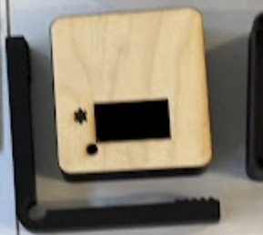
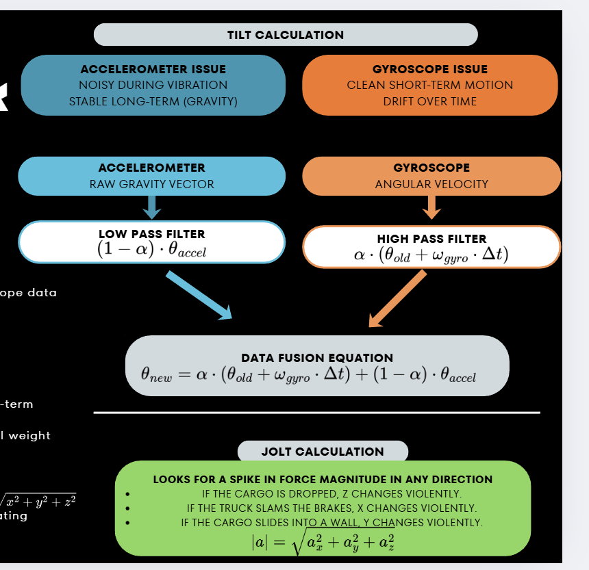
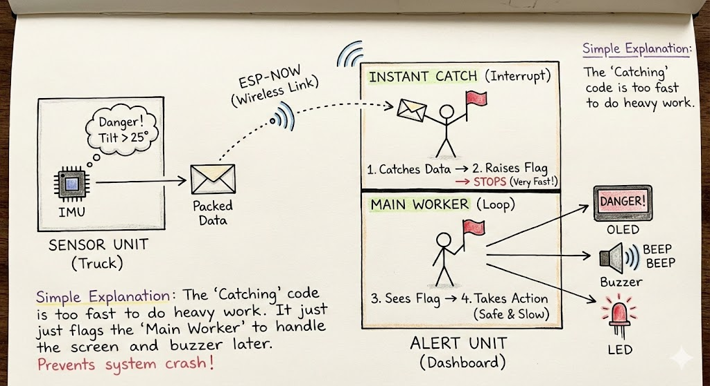
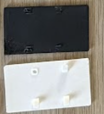
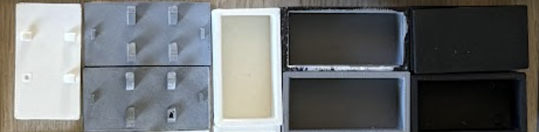
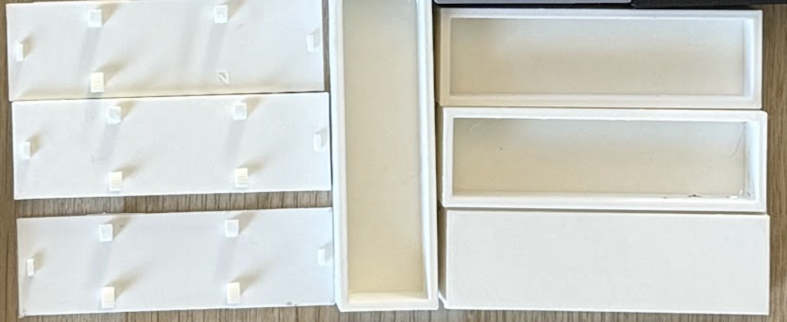
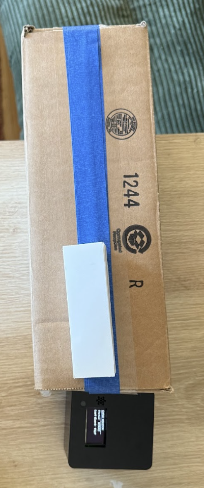
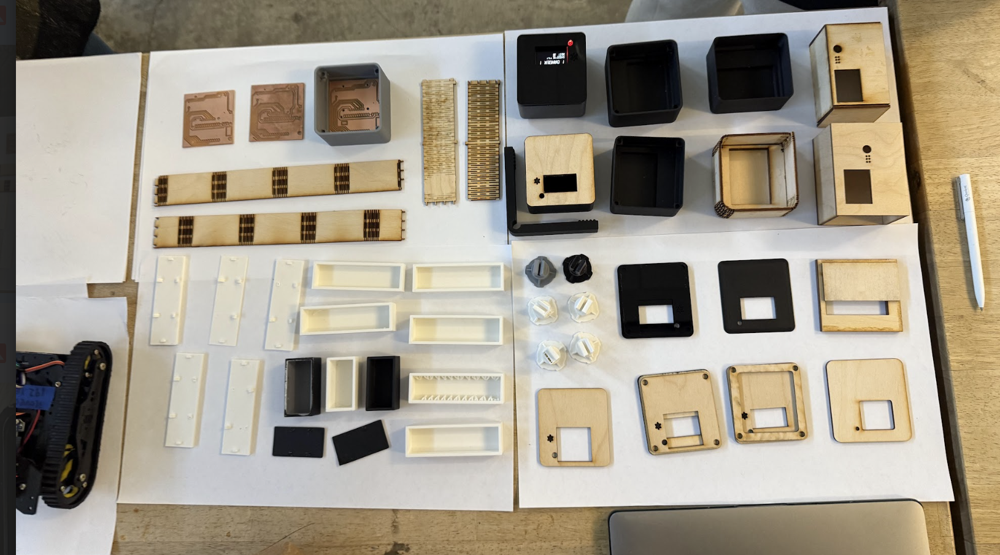
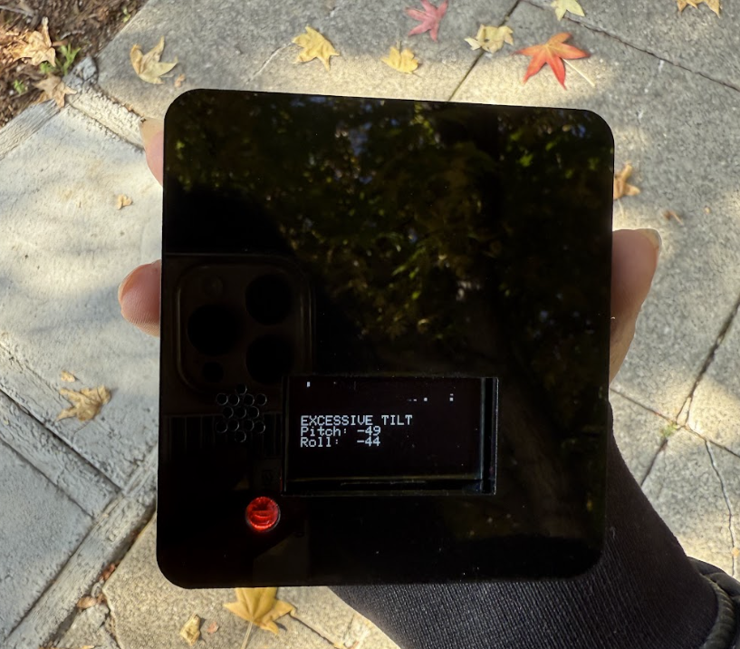

# Liv's Design Journal

Hello and welcome to my design journal. Hopefully this will be a clear representation of everything I have been doing throughout TDF during Fall 2025 and will be an enjoyable read!

I have divided this into a few sections:
1. [The Arduino](#arduino)
2. [Laser Cutter](#laser-cutter)
3. [3D Printing](#3d-printing)
4. [Emotive Origami](#origami)
5. [Expressive Mechanics](#expressive-mechanics)
6. [Ambient Display](#ambient-display)
7. [Final Project](#final-project)


 <div id="arduino"></div>

## The Arduino

### Semester week 2
Never have I ever touched an arduino. Nope. This is so true. So I must admit I was a bit intimidated when we first got our kits filled with electronics. But all the guides were super useful (except for the fact that I hadn't realised I had to load my code to the arduino so I kept pressing run and nothing happened). Finally, I realised I had to do that and magical things started happening!

First off, my arduino came with Blink loaded so as soon as I connected it, it was doing its thing (I thought it might be an error message but no, it was just blink - thank you google for answering my questions).

So step one was forcing off the light:
```arduino
void setup() {
 
  // do nothing except force 13 led off
  pinMode(13, OUTPUT);
  digitalWrite(13, LOW);
}
void loop() {
}
```

Crazy stuff, I know. 

So then we got to make the light blink:
```arduino
int led = 13;  // define a variable to hold the pin number of the internal LED

// the setup function runs once when you press reset or power the board
void setup() {
  // initialize digital pin LED_BUILTIN as an output.
  pinMode(led, OUTPUT);
}

// the loop function runs over and over again forever
void loop() {
  digitalWrite(led, HIGH);   // turn the LED on (HIGH is the voltage level)
  delay(1000);                       // wait for a second
  digitalWrite(led, LOW);    // turn the LED off by making the voltage LOW
  delay(1000);                       // wait for a second
}
```

And I connected an LED to it!


Proceeded to try changing it to pin 8 and then pin 8 and 13 alternatingly! (not all code is included here as they are just variations of each other but it can be found on the github folder this markdown belongs to)

```arduino
int led = 13;  // define a variable to hold the pin number of the internal LED
int ledext = 8;
// the setup function runs once when you press reset or power the board
void setup() {
  // initialize digital pin LED_BUILTIN as an output.
  pinMode(led, OUTPUT);
  pinMode(ledext, OUTPUT);
}

// the loop function runs over and over again forever
void loop() {
  digitalWrite(led, HIGH);   // turn the LED on (HIGH is the voltage level)
  digitalWrite(ledext, LOW);
  delay(1000);                       // wait for a second
  digitalWrite(led, LOW);    // turn the LED off by making the voltage LOW
  digitalWrite(ledext, HIGH);
  delay(1000);                       // wait for a second
}
```

You can see the video here: https://photos.app.goo.gl/9VgwX1SNipQTziiv8
________________________________________________________________________
Homework for this week:
- Write  a program to flash the onboard LED while printing Hello World to serial

```arduino
int led = 13;  // define a variable to hold the pin number of the internal LED

void setup() {
  // put your setup code here, to run once:

  // initialize digital pin LED_BUILTIN as an output.
  pinMode(led, OUTPUT);
  Serial.begin(9600);
}

void loop() {
  // put your main code here, to run repeatedly:
//send 'Hello, world!' over the serial port
  Serial.println("Hello, world!");
  delay(1000);
  digitalWrite(led, HIGH);   // turn the LED on (HIGH is the voltage level)
  delay(1000);                       // wait for a second
  digitalWrite(led, LOW);    // turn the LED off by making the voltage LOW
  delay(1000);                       // wait for a second
}
```

- Make “something interesting” happen with:

1 LEDs + 1 LDR
2 or more LEDs

Ok Sudhu, an open-ended exercise... it's always tough to just try something out with a new medium BUT let me think of something.

So I knew what an LED was but not an LDR (the abbreviation at least). My first step was to test it out. I didn't change my resistor like it was indicated on Sudhu's github page on arduinos but it still worked and made me understand what this magical new tool does (refer to video link below). I used the flashlight on my phone to shed even more light on the resistor and got it up to 41 I believe. 

You can see the video here:
https://photos.app.goo.gl/dGQg98hR28bRwcBfA

So now I am home, after doing all these things during Sudhu's lesson and being exceedingly proud of myself (image evidence below).

Yep, it went on the family groupchat :)


So I tested out the examples you had up, this is one of them: https://photos.app.goo.gl/qhkP5B8pzVw5FaAp8

I think I want to do something that reads an input from the LDR and tells you how bright a 'room' is depending on the value. I drew this out, having the LEDs in parallel. I used gemini to help me create this code but it needed troubleshooting anyway:

```arduino

// Define the pins for your colored LEDs
const int ldrPin = A0;
const int redLedPin = 2;    // For "pitch black"
const int yellowLedPin = 3; // For "ambient"
const int greenLedPin = 4;  // For "super bright"


// Use the Serial Monitor to find the best numbers.
// More light = lower LDR value.
const int brightThreshold = 250; // above this value, it's bright
const int darkThreshold = 150;   // below this value, it's pitch black

void setup() {
  // Set all LED pins as outputs
  pinMode(redLedPin, OUTPUT);
  pinMode(yellowLedPin, OUTPUT);
  pinMode(greenLedPin, OUTPUT);
  
  // Start serial communication so you can find your threshold values
  Serial.begin(9600); 
}

void loop() {
  // Read the value from the LDR sensor
  int ldrValue = analogRead(ldrPin);
  
  // Print the current light value to help you calibrate
  Serial.print("LDR Value: ");
  Serial.println(ldrValue); 
  
  // Logic to turn on the correct LED
  if (ldrValue > brightThreshold) { // Super bright conditions
    digitalWrite(greenLedPin, HIGH);
    digitalWrite(yellowLedPin, LOW);
    digitalWrite(redLedPin, LOW);
  } 
  else if (ldrValue < darkThreshold) { // Pitch black conditions
    digitalWrite(greenLedPin, LOW);
    digitalWrite(yellowLedPin, LOW);
    digitalWrite(redLedPin, HIGH);
  } 
  else { // Ambient light (in between bright and dark)
    digitalWrite(greenLedPin, LOW);
    digitalWrite(yellowLedPin, HIGH);
    digitalWrite(redLedPin, LOW);
  }
  
  delay(100); // A small delay for stability
}

```
So I had tested in the previous exercise what the brightness output was when in my ambient (200ish), if I put my finger over it (100ish) and if I shined a light on it (600 to 800) so I knew I had to make those my threshold values.

Video here: https://photos.app.goo.gl/CKZZgYVm32XcnNbw9

Annnndddddd so now I wanted to try and combine the two and make it dim or not depending on how bright it is and also change colours for different thresholds.

This is a pic of the circuit for the lights:


LLMs are useful because when things don't work, you can usually get help: "Move the LEDs to PWM-capable pins. On most Arduino boards, these are marked with a tilde (~).".

So great, we figured that out. Let's try again.

```arduino
const int ldrPin = A0;
const int redLedPin = 9; 
const int yellowLedPin = 10;
const int greenLedPin = 11;  

// --- CALIBRATION THRESHOLDS ---
// More light = higher LDR value.
const int brightThreshold = 150;
const int darkThreshold = 550;

void setup() {
  // Set all LED pins as outputs
  pinMode(redLedPin, OUTPUT);
  pinMode(yellowLedPin, OUTPUT);
  pinMode(greenLedPin, OUTPUT);

  Serial.begin(9600); 
}

void loop() {
  // Read the value from the LDR sensor
  int ldrValue = analogRead(ldrPin);
  
  // Print value
  Serial.println(ldrValue); 
  
  // Logic to turn on the correct LED with variable brightness
  if (ldrValue < brightThreshold) { // Super bright conditions
    // The GREEN LED gets brighter as the light increases (ldrValue goes up)
    int brightness = map(ldrValue, brightThreshold, 0, 0, 255);
    analogWrite(redLedPin, brightness);
    analogWrite(yellowLedPin, 0); // Turn other LEDs off
    analogWrite(greenLedPin, 0);
  } 
  else if (ldrValue > darkThreshold) { // Pitch black conditions
    // The RED LED gets brighter as it gets darker (ldrValue decreases)
    int brightness = map(ldrValue, darkThreshold, 1023, 0, 255);
    analogWrite(greenLedPin, brightness);
    analogWrite(redLedPin, 0); // Turn other LEDs off
    analogWrite(yellowLedPin, 0);
  } 
  else { // Ambient light (in between bright and dark)
    // The YELLOW LED fades in and out within the ambient range
    int brightness = map(ldrValue, brightThreshold, darkThreshold, 0, 255);
    analogWrite(yellowLedPin, brightness);
    analogWrite(greenLedPin, 0); // Turn other LEDs off
    analogWrite(redLedPin, 0);
  }
  
  delay(10); // A smaller delay for smoother transitions
}

```


I had to edit the code as I had a pull down, not a pull up resistor. 

BUT WE GOT THERE: TADAAAAAA https://photos.app.goo.gl/VDqCrcfi39f5Pdtu9

We did it! I think I understand this whole jazz a bit better now. And in the end, you really need to understand what you are doing in order to set it up correctly aand be able to troubleshoot. I liked that we got to play around with it and just figure it out.

### Semester week 3

RGB Lights. A great invention, in my opinion. However, a bit odd looking!

First thing is first, why does red need a higher resistor?

I connected it to the circuit and at first it did not work because I built the circuit wrong by connecting my pins to a different side of the breadbord than my LEDs. But then, it worked!

It blinked: https://photos.app.goo.gl/wBuv5ETHRRv4dRo49
It faded: https://photos.app.goo.gl/UwmGn9u67qNqHSXb7
And it even faded with some different colours: https://photos.app.goo.gl/LsGbfzP4DooMuMWT7

Pretty cool, huh?

The next few things I did were kinda following the tutorial to get familiar with the different components, how they work, and what they do.

So I had my RGB connected, and it was such a pain to do it that I did not want to disconnect it. Instead, I just connected the button to the circuit and tested it out with the output from only one pin from the arduino, essentially treating it like a blue LED. 

It was a bit weird to understand how the button worked since the example button on the github tutorial has 4 pins and ours only have two. Nevertheless, I eventually figured it out because it had to break the circuit somehow. 

So yay, the button worked: https://photos.app.goo.gl/cX7znGTYjLBT39QC9

Now, I wanted to see if I could make it cycle through red, green, and blue. 

I tried finding some example code online but none of them worked for me. I then tried building the logic but didn't know how to make them change depending on how many times the button was pressed. 

So I had this:

```arduino

// Define the pins for the RGB LED and the button
const int redPin = 11;
const int greenPin = 10;
const int bluePin = 9;
const int buttonPin = 2;

// variables will change:
int buttonState = 0;         // variable for reading the pushbutton status
int buttonCount = 0;
void setup() {
  // Set the LED pins as outputs
  pinMode(redPin, OUTPUT);
  pinMode(greenPin, OUTPUT);
  pinMode(bluePin, OUTPUT);

  // Set the button pin as an input
  pinMode(buttonPin, INPUT);
}

void loop() {
  // read the state of the pushbutton value:
  buttonState = digitalRead(buttonPin);


  // check if the pushbutton is pressed. If it is, the buttonState is HIGH:
  if (buttonState == HIGH & buttonCount = 0) {
    // turn red LED on:
    digitalWrite(redPin, HIGH);
    digitalWrite(greenPin, LOW);
    digitalWrite(bluePin, LOW);
    buttonCount++;
  }

  else if (buttonState == HIGH & buttonCount = 1) {
    // turn green LED on:
    digitalWrite(redPin, LOW);
    digitalWrite(greenPin, HIGH);
    digitalWrite(bluePin, LOW);
    buttonCount++;
  }
  
  else if (buttonState == HIGH & buttonCount = 2) {
    // turn blue LED on:
    digitalWrite(redPin, LOW);
    digitalWrite(greenPin, LOW);
    digitalWrite(bluePin, HIGH);
    buttonCount++;
  }

else if (buttonState == HIGH & buttonCount = 3) {
    // turn off all LEDs:
    digitalWrite(redPin, LOW);
    digitalWrite(greenPin, LOW);
    digitalWrite(bluePin, LOW);
    buttonCount = 0;
  }
}

```

But that did not work and gave me the error "Compilation error: lvalue required as left operand of assignment".

So I went over to Gemini to ask what was wrong as I could ont figure it out. Well, it makes sense but was a bit annoying: "You have repeated the most common mistake that causes this type of error: using a single equals sign (=) for comparison when you should be using a double equals sign (==)."

So I fixed that. and it still did not work. I mean, the code ran but the light was doing some wacky stuff. I think both I and the arduino were unsure of what was going on. So back I actually tried reading through the code to figure out where my logic was wrong. Lo and behold, I found it. Every time I press the button, it will be high, and run the first code of block and immediately run the second, third... so basically it'll just run through all the colours and tur off. So I need a way to make the loop trigger only when the button is pressed and for me to know when it is first pressed so I can start the counter. 

And this is the not very elegnt solution:

```arduino
// Define the pins for the RGB LED and the button
const int redPin = 11;
const int greenPin = 10;
const int bluePin = 9;
const int buttonPin = 2;

// Variables to store state
int buttonCount = 0;
int lastButtonState = LOW; // Variable to track the last known button state

void setup() {
  // Set the LED pins as outputs
  pinMode(redPin, OUTPUT);
  pinMode(greenPin, OUTPUT);
  pinMode(bluePin, OUTPUT);

  // Set the button pin as an input
  pinMode(buttonPin, INPUT);
  
}

void loop() {
  // Read the current state of the button
  int currentButtonState = digitalRead(buttonPin);

  // Check if the button was just pressed (transitioned from LOW to HIGH)
  if (currentButtonState == HIGH & lastButtonState == LOW) {
    
    // Increase counter on press
    buttonCount++;

    // Cycle the light based on the new count
    if (buttonCount == 1) {
      // Turn red on
      digitalWrite(redPin, HIGH);
      digitalWrite(greenPin, LOW);
      digitalWrite(bluePin, LOW);
    } else if (buttonCount == 2) {
      // Turn green on
      digitalWrite(redPin, LOW);
      digitalWrite(greenPin, HIGH);
      digitalWrite(bluePin, LOW);
    } else if (buttonCount == 3) {
      // Turn blue on
      digitalWrite(redPin, LOW);
      digitalWrite(greenPin, LOW);
      digitalWrite(bluePin, HIGH);
    } else {
      digitalWrite(redPin, LOW);
      digitalWrite(greenPin, LOW);
      digitalWrite(bluePin, LOW);
      buttonCount = 0; // Reset
    }
  }
  lastButtonState = currentButtonState;
}
```

So I went to Gemini and asked how I could do this. Well, I learned about the difference in & and && operators in C++ because it told me off for using a bitwise AND (not that I even knew what that was before today). Glad to know && is my logical AND operator. I digress. I also learned that part of the issue I was having with my code (sometimes it would jump two colours at once) is because of something called bouncing (which meant my counter was going up when I did not intend for it to register my press). 

You can see the code it gave me [here.](/Arduino/TDF%202025/week%203/rgb_cycle_button_press_Gemini/rgb_cycle_button_press_Gemini.ino)

I learned you can have case switches which is pretty cool. It definitely made the code look cleaner!

So next up were Potentiometers, which is a fancy way of saying it's a variable resistor. I wanted to understand how it worked and this video was pretty clear: https://www.youtube.com/watch?v=sWbSeJmUFfw. It is actually part of the reason I managed to debug my Servo set up later on in this exercise. 

Here is the potentiometer in action: https://photos.app.goo.gl/gJFR91XgGTXid7C4A

With an LED attached: https://photos.app.goo.gl/gJFR91XgGTXid7C4A and https://photos.app.goo.gl/wfhJ3e1xYx6J7Uhu7

Here is the Servo in action: https://photos.app.goo.gl/9YQyDrByBVSNtXyc6

I forgot to film the potentiometer serving as a knob for it but I also did that. 

However, I tried making it so the delay would be mapped onto the potentiometer in order to make the potentiometer change the sweep speed and failed. I can't think of how to structure the code exactly. I'll ask about it in class!

You can see all of this week's arduino code [here.](./Arduino/TDF%202025/week%203)

### Semester week 4

This week we are focusing on servos and sensors. The sensor we are familiar with by now is the LDR. This week, the ultrasonic sensor and PIR sensors were introduced.

We also learned how to load custom libraries into Arduino's IDE which is super helpful since there are many programmers before us who have converted complicated things into simple fubnctions with their libraries - I am very thankful.

In class, we worked on making the ultrasonic sensor control the servo's position. We used the Ultrasonic Library by Erick Simoes and it worked: https://photos.app.goo.gl/rn3gAfLQwx8U8hZG7 !!!

Next up, I tried out the PIR sensor which I thought looked cuter and more discrete. I used it as a trigger for an LED to test it.

That video is here: https://photos.app.goo.gl/t1vsbjCqyVEhZ9cv7

After getting very excited about seeing that happen, I decided it was time to try connecting it to the servo.

And when the PIR detected movement, the servo would move to 90 degrees and once there was no movement, it would go back to 0. 

This week, we have our first project (emotive origami) and I figured that the PIR would be great for that as I want the program to be motion activated. I do not plan on mapping any values to alter how the servo reacts to motion at different distances or anything like that so this PIR sensor seems suitable. Plus, it's passive whch I thought was cool as it's not really consuming much energy unless it senses movement. 

All of my exploration for the origami section with servos and sensors can be found in the origami tab.


 <div id="laser-cutter"></div>

## Laser Cutters

### Semester Week 2

Week 1 with Chris... the topic? lasers. Automatically, cool. 

I've had so many laser cutting trainings but I had never actually gotten my hands dirty without supervision - it felt like a lot of responsibility. It was great to see the process shown in a clear yet simple way. I have now requested the "Manufacturing Processes for design professionals" on loan from the library (it was too expensive to buy). 

Thank you for the demo during class, it came in very handy.

I first had to think whether I wanted to do a cause I believed in or a personality thing. Recently, I have been thinking about my identity - it is a slightly turbulent topic for me because it is so all over the place (gegraphically and culturally). One of the roots of this is because I have lived in 4 different countries and I identify with a lot of parts of each culture. For this assignment, I thought I could tackles this and make a statement that I carry part of all of them with me!

So I started trying to come up with some ideas:


I setlled on wanting to represent my different roots but also do something that could teach me how to raster, engrave, and cut. This was perfect. 

I love animals and am passionate about having sanctuaries instead of zoos, and adoption in general for any kind of pet. 

So animals and countries (sounds like a 1st grade book title).

Courtesy of Gemini (notice the eiffel tower in Russia, Asia in Grreenland, two Australias and the US as Africa among other things)


So I found images of animals online and trying to image trace them. Some image traces were bad so I started playing with the different setting. Outline worked well, black and white logo for some things and certain images worked better than others. 


I measured the circumference of my fingers roughly with string and a ruler and divided by pi. 

Oh, and then converted to inches because I'm holding onto my metric girly title like it's my life.

After working out some kinks with adobe illustrator (arguably, the worse AI), I started learning some shortcuts and became a wizard (in comparison to how slow I was at the start). I also determined the ring's thickness would be 2mm because I forgot that laser + close together lines is bad.

So this was the first sketch:


I went to print, did everything correctly:


But this came out:


So clearly my outer and inner diameter difference of 2mm was too little and I also could have made sure my print properly fit in the area I wanted to print so I didn't just throw the laser on the bed. I started pointing my laser after this to the most extreme edges to make sure the plywood was not already cut in that area.

I widened the diameters, and tried printing again. 


This time, the width was better but some of my circles were not centered. I tried wearing them and the horse and bear rings were too wide. Additionally, the connections between these animals and the ring were too thin and they easily broke off.

Therefore, I widened the connections, ensured the radius difference was consistent and that the circles were centered. At this point I also did a Chris and forgot to select the material so had to do two passes.

Ta-da:


Some circles were still not super centered and the horse connection was too weak. 

So again, I tried BUT THIS TIME IT WORKED:


I sanded it and these were the rings I ended up making:


 <div id="3d-printing"></div>

 ## 3D Printing
### Semester Week 3

This week, our theme with Chris was 3D printing. We had to print our laser cut rings and then design a 3d ring. 

I chose to 3d print the toucan ring as it has a lot of fine detail that would not be suitable for 3d printing. I imported it into fusion as an svg, extruded the body downward and the details upward, sliced it in prusa and 3d printed it on one of the prusa 3s in the JAcob's Makerspace. 

It actually came out so much better than I originaly expected. The printer is really good. Also, since the plywood was flat and I didn't have any overhangs or anything, it actually did not need supports. 


It was not perfect by any means, and the resolution of the details were low but still impressive. The skirt was a bit hard to take off (you can see some of it in the picture).

I wanted to challenge myself and do something different for the ring. I had some experience with fusion but not loads. After having way too many opttions of what to do, I decided I wanted some sort of cool mechanism. I had some gummy bear pendants around and decided I would use it. The colours can represent my bisexuality as well which serves the personality theme of the assignment. Plus, it has some whimsy. 

My partner is extremely good at fusion so I knew that if I got stuck or didn't know how to do something, I could ask him for help.

The mechanism I wanted would work something like this but internally: https://www.youtube.com/watch?v=fGv8D-E9sgI

The idea was that it could also be an ear-ring... get it?

So once you attach it, it's a double bear ring but unlocked, you could make it into an earring. 

Here are some drawings:

  

My partner helped me figure out how the locking mechanism could work well and flexibly (he suggested a longer notch could be useful to avoid it from being really loose).

So onto fusion! The first sketch looked a lot like what was on the paper. I used a revolve to get the basic shape down. At first, I had the notch being 180 degrees but that seemed a bit excessive. Instead, they are now 90 degrees instead which is much nicer.

He also showed me how I can set a tolerance parameter and just apply it everywhere and how constraints can help in the sektch process.


So I revolved the different components as I said and added some fillets. I knew the supports might be a pain but I liked the design so YOLO.

After making the first body, I remembered I had to add a place to attach the bears with some wire I have at home. I used digital callipers to measure the thickness of the wire (which actually had a lot of variation). The average thickness was 0.98mm so I made the hole 1.2 which I thought would give it enough clearance. 

This is it before I added that bit:


And after:


Added some fillets to avoid scratching against my skin and mirrored them to see if they would actually work as intended in theory:


And so I thought I was ready to give printing it a try. I sliced it in prusa slicer and this time printed it in the mdes studio on a prusamk4s.

Version 1:


And I had intended to make the diameter of the ring 18mm. I built a construction line of 18mm from the Z axis and revolved around that. Which would obviously make 18mm the radius. So the first print was HUGE. 

I then tried scaling it down on the prusa software to an 18mm diameter and printed it. It was super small and the tolerances I needed were all off and clearly that did not work. 

Version 2:


So I had to launch fusion again (dreadful, I know). I adjusted that construction line to 9mm (you can see that in the fusion sketch above). 

And I printed Version 3:


Finally, I could test whether the hole was big enough for the wire. It was not.

So back to fusion again. I made the diameter of the hole for the wire 1.5mm now. It worked!

Now I had to clean the supports and see if the mechanism worked. I enlisted my partner to help with support cleaning because they were tough supports to take out. Even after cleaning as much as we could, the mechanism still would not work. Other tolerances worked fine, the rings stacked onto each other nicely but the rails where they slide on to lock had too small of a tolerance. As you can see in the picture, they aren't staying on the rail and are sitting not straight when you twist it.

Version 4:


So I doubled the tolerances on the rails and tried reprinting the ring. I also wanted to see if I could change the settings of the supports to make them easier to remove.

The grid setting for the supports instead of the automatic "snug" it selects definitely made removing supports easier. I also tried to decrease the amount of supports and I think it worked. 

The new ring worked! Maybe the clearances were a bit much now. So I tried reducing the clearance a bit again but it was too tight. So my final version had this higher tolerance [(it is this file.)](./3d%20printing/Olivia%20bear%20ring%20v5.stl)


Here is the final print with the grid supports:


And with the bears attached: 

And it in "earring mode": 

Although I am not super happy with the aesthetics, I did like the idea and maybe if I sanded and painted the rings, it would look better. Nevertheless, I am quite happy with the final outcome.

 <div id="origami"></div>
 
## Emotive Origami

### Semester Week 4 & 5

こんにちは (konichiwa)!

Welcome to my first TDF project. 

When Chris explained what the project entailed I felt quite intimidated and scared because I was not sure my building blocks from the past few weeks in arduino would be enough to create this.

So I tried to take it step by step. On Thursday evening, after a very stressful day, I decided to go out for dinner instead of cooking at home wit my partner. I took some paper with me and we both started folding the paper and playing with it to get some inspiration. The restaurant had some umbrellas (pictured below) which inspired one of the folds!


The videos of all the folds are here: https://photos.app.goo.gl/5wgLAN3LnwHTpZLM9

My favourite one was the one where it looks like the paper is surprised to see you: 
And my least favourite was me trying to pass part of the paper through a hole: 

On Friday, I went to the makerspace to talk to Chris and ask for help. I had a better idea of what to do but was struggling to figure out how to make the jump from theory to prototyping practice. Chris started showing me how to quick prototype and how you can create composite materials from things at home like string and superglue which together make a very strong attachment:


I was scared that I would break the servo in any attempt to attach it to things so seeing this being made was quite reassuring.

He also showed me how to thread strings through the box using paper clips:


Cody was also there, and he started talking about linkages so during the weekend I did some research and found this AMAZING video: https://youtu.be/0MYF8YCf2jQ?si=LPhq3GxHvMzCudem

My paper movement relies on an arc shaped movement (as you can see in the green arrows in the image below).


So I created three points which form an arc of a circle and figured out the arc I need is part of a circle with a 6cm diameter.


I need my arcs to go in opposing directions so my linkage has to cause a mirror effect or a reverse effect.

So I cut out two cardboard circles, used a cut up paperclip to pin the parts down and kind of got it to work. But it was not great: https://photos.app.goo.gl/oWL8yFq1pDABcX8z5
  
And an updated version that was a bit better: https://photos.app.goo.gl/DA3iuzSULED8PMde7

So I made an adobe illustrator file with the dimensions I needed and laser cut some cardboard circles: 

And it worked! 

However, the cardboard did not feel sturdy enough. So I laser cut the circles out of some scrap plywood in the makerspace. Upon doing this with two holes (one for the center axle and one for the BBQ stick that would hold the bar), I realised I also needed one for the stick that would hold the paper. I knew I needed two press fits and one clearance. I guesstimated the clearance and interference I would need and it worked! To make it more sturdy, in my final version, I also added some hot glue to the bars that would be holding the origami paper.

The files for laser cutting are [here.](./Origami)

Now it was time to focus on the electronics. I first connected all the components and got the servo moving when the PIR ssensed movement. 

  

I thought of pushing one of the attached vertical bars (sticks) with the servo arm using the sturdy attachment Chris showed me. However, this was causing the disk to elevate instead of rotate by pushing on its center axle. I hot glued two rods to the bar that connects the circles to create a cage within which the servo arm would stay. It would then be able to push the bar to and fro bu pushing these arms as it rotates. 

You can see it working here: https://photos.app.goo.gl/Cx4i1QGkqZhgEaXG8

The breadboard wasn't really serving much of a purpose so I decided to connect the PIR to the 3.3V pin of the arduino and the servo to the 5V directly. As a result, I didn't need a breadboard and my circuit worked perfectlly fine. 

Here is a schematic of the circuit:


And it built: https://photos.app.goo.gl/mDsg2ibBSGNfh8yU9

I then cut up the foam board to make a housing, creating a 20cm x 20cm box. I placed the cardboard in there and attached the paper to it: https://photos.app.goo.gl/GfQ3UNMuHM62YLaU7 .

The paper's fold, (even with an added slot in the back to aid folding) required too much force to fold and was not working reliably. I tried refolding it, making it smaller, making it larger etc. but the fold was just ot great for the level of rigidity of the vertical rods (aka BBQ sticks). 

I ultimately determined (after discussing with my mechanical engineer boyfriend) folding it twice and making a double hinge would give it more leverage. So I tried doing that. Lo and behold, it worked. 

Here are all my attempts and my first duoble hinge attempt in one picture:


That actually worked! So I folded a new and fresh piece of paper and realised it looked a bit like a clam. I decided to lean into this idea and even made it its own plaque (https://photos.app.goo.gl/fHZ9rCn6Hv3iYyMv9).

I made a lid for the paper to rest on, cut the sticks to size, and placed the paper on it. The hardest part was measuring the arc to cut it and the holes for the paper to sit on. For the arcs, I measured three different points on its path, cut a paper oversized and traced this onto the foam board.

Here is the paper: https://photos.app.goo.gl/zWSZK1yEK5RFHnQW7

And for the sticks, I coloured the ends with a sharpie, it tinted the paper where it had to fit into and I cut those holes in the origami shape. I then cut off the ends and ta-da! Final prototype done!

I have genuinely never felt so excited at seeing this final product. It took a lot of frustration, excitedness, more frustration, and shock (get it? cause my clam is in shock.) but we got there!

Here it is, working: https://photos.app.goo.gl/zDDhHoi3cZqeT4SU8

I was so happy the system was self contained. I added Gaffers tape to the edges to make the ifnish a bit better (which it does so in a darker lighting).

You can see the portfolio piece here: https://drive.google.com/file/d/1tJ1uN8y9slfYgF-QBYedBSq-EBCs4XFo/view?usp=sharing .

Thank you for reading this far!

I am both terrified and looking forward to the next project!

 <div id="expressive-mechanics"></div>

## Expressive Mechanics 

Going forward, I am going to try restructuring my design journal to make it easier for you guys to mark (you guys being whoever is reading this). I will continue to take a friendly approach here and try to make it more fun and friendly than the portfolio pages (aka less professional)!

### Week 6
Total System Panic. I thought we were going to get a week or two to play with the esp32s and then do a project using those. Nevermind, I should have looked at the syllabus. Anyway, there is no use crying over spilled milk so in we go!

We heard about this new project on Tuesday in class and that is when we started looking into p5.js.
#### Electronics
I spent this week understanding how the motor works and why we need the H-bridge, connecting those things, and getting the wires soldered to the motor. These articles were useful in this ordeal:

* Sudhu's arduino tutorial: https://github.com/loopstick/ArduinoTutorial
* https://digilent.com/blog/what-is-an-h-bridge/?srsltid=AfmBOoq8O3mvVgUnv4-zKr4GBJVSJXLV8vJmseLv44tYIk-pFneNw3t9
* https://forum.arduino.cc/t/why-should-i-use-a-h-bridge/4772
* https://learn.adafruit.com/adafruit-arduino-lesson-13-dc-motors/overview

Soldered the wires to the motor: 

So I connected all the wires and it did not work, sent Sudhu a message in panic, and it was because the shorting blocks were connceted. I read this on the github bubt thought it only applied to batteries (cells) for some reason. 

My panic receipts:


I tested it with Sudhu's head tilting code and it worked which was exciting to see: https://photos.app.goo.gl/rfFNqiWAqbWNS2t49

#### Fabrication
In the meanwhile, I was trying to think of something to do. I enjoyed the idea of having something that opens and closes so decided to go with this idea for this project as well. While trying to get inspiration for this, I came across this cuteness:


This is TJ, the IBM box!

I loved the simplicity of the face and wanted to do something like this. This was the ideation:


I also saw this article on how to use a crank and piston to convert rotational movement to linear movement: https://learn.birdbraintechnologies.com/hummingbirdduo/projects/laser-cut-mechanisms/laser-cut-mechanisms-cranks-with-pistons/

With these two things, I knew what I wanted to do. But how to do it...

I tried making the mechanism first and seeing if it would work. The guides being closed caused too much friction because i did not leave enough clearance. While speaking to Chris, he showed me how the guides could be almost like rails and I decided to go with that approach. He also told me how adding a slit to the press fits would help not crush the dowels and would still hold everything in place.

Initial cardboard mechanism:


Chris and I communicating:


With the new knowledge on the clamping, I made a size guide which was too thinly cut and a better guide version where I tested the different clearances to get the fits I wanted.

Here they are:


Made press fit and clamp washers/ end-stop: 

and cut my first plywood version of the box that would house everything. 

### Week 7
I was unable to get a picture of the first version of the box because when I went to sand it, the rotating belt sander and my finger had an encounter. The result? Urgent Care, pain, maybe no longer a fingerprint, and a lot of delays. This was so frustrating and painful, I cannot even explain it. The doctor said it will take 3 months to heal fully ( hopefully less).

#### Fabrication
Anyway, skip forward 2 days, I was able to laser print the components using plywood and got a really shoddy version working: https://photos.app.goo.gl/YgjakDU2g3b5LDsq6

The crank (8cm diameter) was too big which meant a lot of clearance between the motor and the bottom of the box would be needed. I wanted the boxes to be 10 x 10 x 10 cm because I felt that all the coponents would fit in that space but would keep the design cute and small-ish. 

Therefore, I reduced the crank size. The hole in the middle is where the 3d-printed adaptor goes and 

the holes on the side were meant to give me more options on where I can place the dowel in case I wanted to shorten the second linkage. 

Ta-da: 

To get it all glued together, I needed my boyfriend's help because i could not use my left hand at the time. He helped me sand the outside of the box as best he could and was my hot glue gun hand. I wasn't on it so I did not take as many pictures of the process as I would have wished, I am sorry.

This is the guide working with the piston and crank: https://photos.app.goo.gl/pmzGDU4aGgAwMj5R7. 

To allow enough clearance for the linkage to not hit the bottom of the box, I used foam board stacked to lift the motor up because the piece of wood I had put holes in to attach the motor was too thick for my screws and there was no way I was getting near a sander any time soon. 

Although this worked, the piston was not strong enough to hold the top side of the box. I had made a housing for the piston top to fit into on the box (can be seen in my sketches with chris and on the bottom left side of this picture): 


I glued the piston onto the housing and the housing to the top box. WIth this fixed in place and more rigid, two pieces of wood were glued to the sides of the box on the back corners to guide the movement up and down. The connecting linkage was removed and ta-da, the most painful project in my history was done ( the mechanism that is).

The new system: https://photos.app.goo.gl/nE4V77eVkuffKJxu8

Also, I made a lil box with wire holes for the arduino and bridge: 
#### Electronics

The electronics part was done from the previous week. I spent this week on the p5 code. 

I wanted the box to move faster the more times the user opened and closed their mouth within a given time frame. 

I mapped this from 0-255 but the issue was that anything below 85 was too little current to lift the box. Therefore, I mapped it between 85-255 and set it to 3 different buckets. If the person opened and closed their mouth once every second, it would send 85 as the motor speed to the arduino, 2 would be 170 and 3 would be 255. This worked but the code had the lips as 2 green dots which was not great user interaction.

I found this awesome example online of the lip contour and decided a really extra and strong lip colour could be fun.

The example: https://editor.p5js.org/ima_ml/sketches/8xB4wpH16

You can see this in my second and final p5 version of the code. 

Additionally, when showing my partner, he did not like how it was in discrete buckets, he said it made the movement too finisky and not smooth. I agreed, in pain because I thought I was done with the code by then, and this meant editing again. 

The issue with making it a continuous mapping is that I had to add two distinct statements. One for if the user's mouth was not moving and a second statement for any movement to map between 85 and 255. I set the max openings to 6 per second which would map to 255.

Essentially this is what the code does:

1. Loads a pre-trained machine learning model from ml5.js called faceMesh, which is specifically designed to find and map human faces.
2. Activates webcam and feeds the live video into faceMesh model.
3. In real-time, model scans each frame of the video to locate the face and identifies 478 specific points (landmarks) on it. These points outline the eyes, eyebrows, nose, and lips with decently high precision.
4. I focus on two landmarks: one on the upper inner lip (keypoint 13) and one on the lower inner lip (keypoint 14). It constantly calculates the pixel distance between these two points (this was tuned manually - the best distance for speech that can see  minor movements were 2 pixels (1 was too unreliable and would sometimes trigger with no movement)). So essentially, 1 pixel + 1 pixel as error-correction.
5. If the calculated distance becomes greater than the MOUTH_OPEN_THRESHOLD (the pixels), the code registers that the mouth has opened and increases a counter. It only counts the transition from closed to open, so holding your mouth open doesn't add to the count.
6. To show what it's tracking, the code uses two detailed lists of lip landmarks (lipsExterior and lipsInterior) to draw a colored, filled-in shape that perfectly outlines the user's lips on the screen (taking inspiration from the example code above).

Here is a flowchart of the code as my diagram requirement:


Whenever I encountered bugs that I just could not figure out, I used gemini. A lot of the code is a frankenstein of Sudhu's example code and the code I found online for the lip tracking.


Here is the final video demonstrating everything working in unison: https://photos.app.goo.gl/L4ytnDgEWUCuHFq38 !

 <div id="ambient-display"></div>
 
## Ambient Display
Hello and welcome to sprint 3. This first week was more ideation, forming teams, and getting a hang of the esp32 and its inner workings. 
### Week 8
#### Fabrication
Week 1, I found a partner, Nikhilesh and we started brainstorming ideas. We both liked the idea of lights but were more interested on making something purely mechanical. Regardless, I explored existing APIs, and we came up with some random ideas. We were both really interested in using google maps api but the more we fleshed out the ideas, we realized that the information it provided would be too critical for an ambient display in its pure form. So we shifted ideas. I checked out multiple different websites and repos to find out which apis would be cool to use. 

Here is our first brainstorm:


And our fleshed out google maps api idea that seemed too critical:


None of them really called my attention (and I must have gone through hundreds.) So we agreed to go home and each have more of a think on what we could do. The result, I was listening to music, trying to figure out which api could be cool and BAM it hit me... Spotify must have an api. And so it did! Great, which ideas could we think of this?

So we brainstormed what the spotify api could do ambient-wise that could be nice.

Here is that brainstorm:


Great, we had a semi-fleshed out idea.

Nikhilesh and I agreed that it would be important to think of a simple idea so we could make it the best we could. We thought the hourglass looking one would be appropriate. It would go up and down as the song played. Up for one song and back down in time for the next song. And repeat this cycle. This seemed simple enough (oh how wrong we were simplicity-wise).

As Nikhilesh very nicely put it:
The Ambient Displays project should explore how data could be translated into subtle physical feedback through the lens of Calm Technology. Using the ESP32 microcontroller and live web API calls, we were tasked with creating a device that communicates information through gentle shifts in light, color, or movement. The focus was on designing interactions that stay at the edge of awareness—quietly informative, aesthetically balanced, and seamlessly integrated into everyday life.


#### Electronics
In the meantime, I tried familiarizing myself with the esp32.

So as my finger was still in pain from the previous project, I got help with the soldering from a friend called Ryan who is an MEng student. Cannot take credit for that. 

Got blink to work: https://photos.app.goo.gl/MH6CsjU3GPgxf3qDA

Connected it to the api: https://photos.app.goo.gl/8RMir5wpGLaAEphx5

And connected it to the api which required an api key: https://photos.app.goo.gl/mRcbt4f2a8mUfKsZ6

So having done this, I felt like I could start thinking about the project. 


As I was thinking about the project, I looked into the spotify authentication process. It was not going to be fun. 

Basically, the maini issues are the complex authentication and heavy encryption required to communicate with the Spotify API. Instead of a simple, static API key, Spotify uses OAuth 2.0, which requires a web browser for login and a callback server to exchange codes for temporary access tokens which isdifficult to do on a microcontroller without a screen. Plus, all of this communication uses HTTPS (SSL/TLS) which is computationally expensive, and consumes a significant portion of the ESP32's RAM and processing power just to establish a secure connection (I thought that would be ok. It was not but we will get to that in a week).

So as I was becoming disillusioned with my prospects, I did what was necessary - I performed a google search. Tough, I know. Well, my evening quickly turned around from sadness to  a success. SOMEONE HAD MADE A LIBRARY FOR THE SPOTUFY API FOR ESP32s: https://github.com/FinianLandes/SpotifyEsp32. FinianLandes, my hero (and the other 5 ocntributors too). That night I slept very very peacefully. This would be doable!


### Week 9

#### Fabrication
This week we split up into our respective tracks. Nikhilesh and I split the project into two. I focused on getting the electronics and Spotify API integration to work reliably, ensuring the ESP32 could pull real-time song data and translate it into output signals. Whlst Nikhilesh would integrate those electronics into the form factor.

We further explored the idea, and thought of how lipsticks translate upward in linear motion through rotation. I knew Nikhilesh was excited to really dive deep into making reliable, detailed mechanics.

In his other projects he had used the rack and pinion mechanism. However, for this device, the compact form factor we had envisioned required something more self-contained. The goal was to achieve smooth linear motion without taking up much space or requiring external alignment.

After some research, he found a thread-based linear actuator, which converts rotational motion into linear movement through a screw mechanism (remember the lipstick?).He modeled and 3D-printed a small prototype to test its reliability, and it worked perfectly for our needs. He sent me this video that day: https://drive.google.com/file/d/1lRXTWjjKgw9yA4f-auUxu6yUOKmD-cqg/view?usp=sharing.

With the proof of concept being done, he told me how many rotations we might neeed. But due to the way our electronics worked out, I instead asked him whether he would be able to translate the distance we wanted in 100 rotations of the motor's shaft. The happy news versus using the servo (you will learn more about our choice of motor in the electronics entry), was that the motor we used was much smaller and compact, which was good for the compact mechanism we were making. However, this meant he had to make 100 rotations become more or less 5 revolutions of the mechanism. Using the servo would have meant more gearing ratios as well so using the dc motor with an encoder would allow hopefully for a slightlly less complicated gearing system. Nevertheless, this was the first time Nikhilesh had to tackle such a complex gearing situation. 

He was inspired by Chris’s class examples and YouTube (a true saviour throughout this project) references he had been following. The key was to break down the problem to find what he wanted to achieve which was a 20:1 ratio. To achieve this, he designed a three-stage gear system that connected the Pololu motor to the main mechanism (Motor Shaft → 10T₁ → 30T₁, then 10T₂ → 24T₂, then 10T₃ → 28T₃ (Output)). Each stage multiplied the reduction, allowing for the smooth, controlled motion that matched the pace we wanted for the device’s slow vertical growth.

Gearing: 


The printing:


I sent him the pololu engineering drawing so he could understand the dimension (he could measure the other components himself as we have duplicate kits but we only had 1 motor):


He did not include space for the breadboard but I was able to make the shared ground be on the H-bridge instead of the breadboard so we could get rid of it to preserve space.

He made this beautiful render from the dimensions (with considerations for so many things, I was so impressed):


More parts printing: 

And here is his first test print with all the components: 


#### Electronics
New week, new me. So I found that library and decided to do the getting started steps. Due to the way Spotify authenticates, you need to know two different unique identifiers in order to get the third (the refresh token). 

These are the instructions on how to do this in the spotifyesp32 library:
```arduino
1. Create a Spotify Application
Go to the Spotify Developer Dashboard.
Create a new application and copy your Client ID and Client Secret.
Add the following redirect URI: https://spotifyesp32.vercel.app/api/spotify/callback
Enable the Web API option.
2. Example: Login without a saved refresh token
#include <Arduino.h>
#include <WiFi.h>
#include "SpotifyEsp32.h"

const char* SSID = "your_ssid";
const char* PASSWORD = "your_password";
const char* CLIENT_ID = "your_client_id";
const char* CLIENT_SECRET = "your_client_secret";

// Create an instance of the Spotify class (optional: specify retry count)
Spotify sp(CLIENT_ID, CLIENT_SECRET);

void setup() {
 Serial.begin(115200);
 connect_to_wifi();

 // Optionally set custom scopes the available scopes are listed below
 // sp.set_scopes("user-read-playback-state user-modify-playback-state");

 sp.begin();
 while (!sp.is_auth()) {
     sp.handle_client(); // Required for receiving the authorization code
 }

 Serial.printf("Authenticated! Refresh token: %s\n", sp.get_user_tokens().refresh_token);
}

void loop() {
 // Your code here
}

void connect_to_wifi() {
 WiFi.begin(SSID, PASSWORD);
 Serial.print("Connecting to WiFi...");
 while (WiFi.status() != WL_CONNECTED) {
     delay(1000);
     Serial.print(".");
 }
 Serial.println("\nConnected to WiFi!");
}
```

I had some trouble connecting to my wifi. I was using my hotspot so I could work on the project from anywhere but for some reason it was struggling to connect. Maybe my phone was on 5GHz. I'm not sure yet. But after about an hour of ensuring the password was right and eventually moving locations, my hotspot connected and I managed to get the refresh token: https://photos.app.goo.gl/KGWanpmCppfFGzKp9

So I went and tested out the example code to get a song's artist and track name. And success! After tweaking things here and there, it worked! Here is the magic: https://photos.app.goo.gl/Dw9TambVuFxeQMD87

Things were looking up at the moment, the library was working, great!

So next up, trying to figure out the hardware that would work to get this to work. So we first thought a servo would be good - it knows it's position and it moves. However, due to its limited 180 degree movement, we would need too many gearing ratios to get the translation we wanted vertically. So what now? I asked Sudhu if we had any motors with encoders and he said no BUT I found one at home. So now I needed to understand how to connect it and how it worked. As we wanted the structure to go up and down and to change the pwm of the motor, we would need the L298N H-bridge. So we had the components but needed a JST 6 pin cable as the motor I had did not have one. Jacob's did not have the cable but Hesse Hall did. With all the components in hand, it was time to see if we could get the motor to run. Nikhilesh was still adamant we could do it with the servo so I tried it out. The codes are [here](<Project 3/ESP32/servo_esp32_sweep/servo_esp32_sweep.ino>) and [here](<Project 3/ESP32/servo_test_milliseconds/servo_test_milliseconds.ino>). 

The servo: https://photos.app.goo.gl/HChSA4pq7HKiaYEE9


The servo movement would be jittery, it would move to specific locations but it would not be a super smoothh ride. Plus, we were not sure whether the torque would be enough to lift the system up. I personally thought it would not work and would be much more work than it was worth; especially considering the fact we had the pololu motor (this is what you will see me calling the motor with the encoder from now onwards.) 

So I got it connected and moving: [code](<Project 3/ESP32/test_encoder_motor>) and here it is in all its glory: https://photos.app.goo.gl/9RnFy6rdxE3tJRqx7

Beautiful: 

Great. That was working but I accidentally connected it to the plug and my laptop simultaneously and some smoke happened. WHich is never good. I quickly disconnected everything. I went to Sudhu who told me to try blink. I did, the esp32 was working (yay). Tried the motor with the simple L298N H-bridge code (the library has the example). 

So next up, I had to get the api to give me the info I needed. So the library has simplified functions to call different api endpoints but the issue was the information I needed was not in any of the simplified functions. So the next step was creating those simplified functions. I forked the repo and created an SpotifyEsp32Modified Library with the endpoints I needed. I created one function that would act as my single api call as to not pass the api call rate. Getting all the info from that call would solve an issue I encountered where I accidentally sent way too many calls in way too little time to the api. So I took the evening off after that, created the new endpoints and tested them the next morning. It was working! Here it is: [ta-da!](<Project 3/ESP32/get_song_duration_one_API_call>)

### Week 10
#### Fabrication
A lot of work done for one week so far, but a lot to go. Getting everything tested out together, and seeing if the system is translating the distance we expected it to. Thankfully, Nikhilesh gave it some wiggle room so it could run about 1.5 times and still work without breaking. 

The bracket to hold the pololu was too big so we had to print one with tighter tolerances. Nikhilesh likes having more tolerance than needed generally, which is quite the opposite of me so it was an interesting comparison. 

Here are all the components: .

He built a final test bed to connect and verify all the electronic components would fit properly. Understanding the spatial and wiring needs of these components was key to his design for the enclosure. His goal was to fit everything efficiently into as few parts as possible while keeping it safe, organized, and easy to assemble. This part was the most time-consuming for him and the bprint of the bed assembly took around 7 hours I believe. The 3D-printed parts, tolerances, and gear assembly work exactly as he'd modeled them!!! So we had a working assembly, our electronics fit perfectly, the gears worked (yay).

One of the personal challenges Nikhilesh set for this project was to build the prototype without using any glue. Every component was designed to snap-fit or screw together, allowing for complete modularity and easy repair. This approach demanded careful planning of tolerances and joints on his part, but resulted in a much cleaner and more flexible build. This was also useful during our final demo, as we could easily disassemble the device to explain its inner workings and highlight how each part contributed to the overall system.

Here is our test of everything working!!!! :::: https://drive.google.com/file/d/1mCrReEmFCRngre6Z89knKuiZ2ub0eiRs/view?usp=sharing

And here you can see the inner workings: https://drive.google.com/file/d/1eAZ5z_C_LQ_cuJr_7GpsOxkQvh2H7hfn/view?usp=sharing.


#### Electronics 
One week left- scary. So I knew I would have to have a control loop going in order to make my set up work. I would have a target speed and have to match the pwm to that. But as we know, motors are not perfect and so variation is to be expected. Therefore, I had to get a control loop. To do that I had to figure out my gearing ratio (1:75) because the box I had was not accurate (it said 1000:1 and 12 counts per rotationn on the encoder). Experimentally, I found that it was actually 6 counts per rotation and that the gearing ratio was between 1:70  and 1:80. Looking on their website, they only do 1:75 so that was it! And it wouuld clock 6 encoder counts per rotation. Conclusion? We had a 6 count encoder on a 1:75 motor. Therefore, in order to reach 100 rotations (which would inform the gearing ration Nikhilesh would make), the encoder would have to count 45000 times. The 

So we know the motor needs to travel 45000 encoder counts in exactly the song's duration. But it can't just run at constant speed - if it did, any small error would accumulate. By the end of a 4-minute song, we might finish 10 seconds early or late. Therefore, we would need a dynamic target speed. The chosen way to do this was through a PID control system (thankfully I live with a mechanical engineer who was able to explain to me how the theory works and directed me to additional resources). You can learn all about it here: https://www.reddit.com/r/robotics/comments/ll765t/how_to_control_a_dc_motor_with_an_encoder_using/, https://www.vexforum.com/t/integrated-encoder-motor-pid-control/43563, https://smithcsrobot.weebly.com/uploads/6/0/9/5/60954939/pid_control_document.pdf.

Here is a quick overview of what it does:

- The P-Term (Proportional):
  - The P-term looks at the current error (target speed minus actual speed) and says respond proportionally to how wrong we are right now. In my code, Kp = 0.2 means "for every unit of error, apply 0.2 units of correction." If target is 100 and actual is 80, error is 20, and P contributes 4 to the output. This gives immediate response - the bigger the mistake, the stronger the correction.
  - The issue is the P-term alone has a problem as it creates a steady-state error. Imagine we are constantly just below the target and never quite reaching it. The P-term alone can't eliminate this persistent offset because as you get close to the target, the error gets small, so the correction gets weak.
- The I-Term (Integral):
  - The I-term acts as the system's memory. It continuously adds up all past errors over time. So If we've been consistently running 2 units slow for the last 30 seconds, the I-term accumulates this and expresses that we need more baseline power.
  - So the P-term responds to being slow right now, but the I-term learns we've been fighting this battle for a while, we need to increase the power even when our speed is close to target.
  - We set Ki = 0.2 and included an anti-windup clamp at ±400. Without the clamp, if the motor physically can't go any faster (maybe we've hit a mechanical limit), the I-term would keep growing and gorwing trying to fix something that just can't be fixed. When we finally could move again, this huge accumulated value would cause a violent jerk. The clamp prevents this by limiting how much the I-term can contribute.
- The D-Term (Derivative):
  - The D-term looks at how fast the error is changing and dampens rapid movements. If our speed is increasing quickly toward the target, the D-term says that we are accelerating way too quickly and if we keep doing this, we will likely overshoot."
  - This helped reduce some of the oscillation we saw at the start
  - Kd = 0.001 is deliberately small because too much D-term makes the system sluggish and unresponsive. Our pololu needs quick response (hence strong P and I terms) with just a tiny bit of damping to prevent oscillation.

- How they work together:

  - Every 50 milliseconds, the controller:
    - Calculates error (how far from target we are)
    - P-term: Respond to this error proportionally
    - I-term: Plus add in accumulated historical error
    - D-term: But subtract a bit if we're changing too fast
Sum all three and send the result to the motor

In orde to find the values that worked for the motor, it required callibrating it through trial and error. The first term to callibrate was the P term. I asked Gemini to give me a simple control for the pololu:

```arduino
// --- PIN DEFINITIONS (Based on your table) ---
const int ENA_PIN = 27; // Speed (PWM)
const int IN1_PIN = 26; // Direction (A0)
const int IN2_PIN = 25; // Direction (A1)

const int ENCODER_A_PIN = 14; // Encoder Signal A (A2)
const int ENCODER_B_PIN = 15; // Encoder Signal B (A3)


// --- CONTROL VARIABLES (ADJUST THESE) ---
// Set your desired speed in encoder counts per second
float target_speed = 500.0; 

// The motor will stop after reaching this total absolute count
long max_count = 10000; 

// Proportional Gain (Kp). This is the value you will "tune".
// Start with a small value like 0.8 and increase it until the motor
// holds its speed well without oscillating wildly.
float Kp = 1.2;


// --- GLOBAL VARIABLES (Internal use) ---
// Volatile variables are used because they are modified inside an ISR (Interrupt Service Routine)
volatile long encoder_count = 0;

// For calculating speed
long last_encoder_count = 0;
unsigned long last_time = 0;
float actual_speed = 0.0; // Calculated speed in counts per second

// PWM properties for ESP32
const int PWM_FREQ = 5000; // PWM frequency in Hz
const int PWM_CHANNEL = 0;
const int PWM_RESOLUTION = 8; // 8-bit resolution (0-255)


// --- INTERRUPT SERVICE ROUTINE (ISR) ---
// This function is called automatically every time ENCODER_A_PIN changes state
// It must be as fast as possible. No delays or serial prints here!
void IRAM_ATTR readEncoder() {
  // Read the current state of the encoder pins
  int b_state = digitalRead(ENCODER_B_PIN);
  
  // Basic quadrature decoding
  // Determine direction based on the state of B when A changes
  if (b_state > 0) {
    encoder_count++; // Clockwise
  } else {
    encoder_count--; // Counter-clockwise
  }
}


// --- SETUP ---
void setup() {
  Serial.begin(115200);

  // Set pin modes
  pinMode(IN1_PIN, OUTPUT);
  pinMode(IN2_PIN, OUTPUT);
  pinMode(ENCODER_A_PIN, INPUT_PULLUP);
  pinMode(ENCODER_B_PIN, INPUT_PULLUP);

  // Configure ESP32's LEDC for PWM signal on ENA pin
  ledcSetup(PWM_CHANNEL, PWM_FREQ, PWM_RESOLUTION);
  ledcAttachPin(ENA_PIN, PWM_CHANNEL);

  // Attach the interrupt to the encoder A pin
  // It will call readEncoder() whenever the pin's state changes (RISING or FALLING)
  attachInterrupt(digitalPinToInterrupt(ENCODER_A_PIN), readEncoder, CHANGE);
  
  // Record the starting time
  last_time = millis();
}


// --- MAIN LOOP ---
void loop() {
  // Check if the motor has reached its maximum travel distance
  if (abs(encoder_count) >= max_count) {
    // Stop the motor
    digitalWrite(IN1_PIN, LOW);
    digitalWrite(IN2_PIN, LOW);
    ledcWrite(PWM_CHANNEL, 0);

    Serial.println("Max count reached. Motor stopped.");
    
    // Halt the program
    while(1) {
      delay(1000);
    }
  }

  // We run the control logic on a fixed interval (e.g., every 50ms) for consistency
  if (millis() - last_time >= 50) {
    
    // --- 1. Calculate Actual Speed ---
    long current_count = encoder_count;
    long delta_counts = current_count - last_encoder_count;
    
    // Calculate speed in counts per second
    actual_speed = (float)delta_counts / ((millis() - last_time) / 1000.0);
    
    // Update variables for the next loop
    last_encoder_count = current_count;
    last_time = millis();
    
    // --- 2. Proportional Control Logic ---
    // Calculate the error
    float error = target_speed - actual_speed;
    
    // Calculate the motor output power. This is the "P" in P-controller.
    int pwm_output = Kp * error;
    
    // --- 3. Drive the Motor ---
    // Constrain the output to the valid PWM range (-255 to 255)
    pwm_output = constrain(pwm_output, -255, 255);
    
    // Set motor direction and speed
    if (pwm_output > 0) {
      // Forward
      digitalWrite(IN1_PIN, HIGH);
      digitalWrite(IN2_PIN, LOW);
    } else {
      // Backward
      digitalWrite(IN1_PIN, LOW);
      digitalWrite(IN2_PIN, HIGH);
    }
    // Write the speed (power) to the motor driver
    ledcWrite(PWM_CHANNEL, abs(pwm_output));
    
    // --- 4. Debugging Output ---
    Serial.print("Target: ");
    Serial.print(target_speed);
    Serial.print(" | Actual: ");
    Serial.print(actual_speed);
    Serial.print(" | Count: ");
    Serial.print(encoder_count);
    Serial.print(" | PWM: ");
    Serial.println(pwm_output);
  }
}
```

It gave me a P-control which basically only considers p-gain and this is not the most robust approach. So I requested specifically a simple PID loop, tested it, found it oscillated, and proceeded to debugusing gemini which was really helpful in understandng what the effect of different terms were. Additionally, it made me realize that we would need a min_pwm_start to overcome static forces. When the motor is at a complete halt, starting it may require more pwm than the song needs to run (you can see the code without the min pwm start and deadzone [here:](<Project 3/ESP32/PID_control_test_1/PID_control_test_1.ino>))

 Through experiments, I found that at 50 pwm the motor still ran fine but below 70 pwm it would not start. So I also requested gemini to add these variables. SPEED_DEADZONE = 10 (counts per second) is a speed threshold and essentially checks whether the motor essentially stopped or barely moving? and will apply a startup boost essentially. 

Here you can see the Ki being too low: 


And the Kp and Kd being too high and causing crazy oscillations:


Here you can see the chat:
https://gemini.google.com/share/e92ad71c08c8

After probably 10 hours of tuning, and figuring out the different variables I needed, and teh encoder count for 100 rotations, and all the small things that would make the loop run accurately, we had a working PID controller! And we found that the song could be comfortably between 1 and 6 mins long. More than 6 mins and the pwm would be too small for the motor to move. Less than 1 minute and the motor would speen too quickly, causing quite a bit of instability to the structure and making a lot of noise. 

I tested it for 50 rotations, 100 rotations, and 200 rotations. With the time to callibrate I had, 100 was the most consistent and least oscillating code: [you can see it here](<Project 3/ESP32/motor_100_rotations_1_to_6min_song/motor_100_rotations_1_to_6min_song.ino>). And here is the code getting it to [get to a certain encoder value and stop:](<Project 3/ESP32/reach_certain_encoder_value_and_stop/reach_certain_encoder_value_and_stop.ino>).

Some additional safety limits of the motor control:
- If the encoder count reaches 45,000, stop immediately (journey complete)
- If time remaining drops below 100ms, set target speed to zero (essentially finished)
- These prevent erratic behavior at the very end of a song

Having two working codes, you would think it would now be easy to get everything working together. You thought wrong (and so did I). Nope. No. Not at all.

So I have the PID loop running every 50ms. This amount of time reduced the oscillation levels and kept the motor movement pretty stable. My spotify api was being called every second to avoid sending too many requests. 

When combined, the issue was, the Spotify API call (get_current_playback) is a blocking network function, meaning it completely froze the ESP32's main processor for several seconds while it waited for a response over Wi-Fi. This freeze was stopping the 50ms motor control loop from running, causing insanely buggy behavior (the motor would move forward and backward to try and correct itself, it was super jittery and awful) and delayed the printed logs. 

So the I made the only reasonable google search anyone could do:


AND THANKFULLY (another miracle), the esp32 has 2 cores. Bear in mind this wa T-4 until demo day and the panic was high. So I know nothing about parallelization and how to run tasks on different cores. All I know, is it can sometimes get a bit dangerous (thankfully the esp32 has some fail stops in place to avoid bad things from happening though).

So I had to use the ESP32's dual cores, having to move the slow, blocking Spotify network task to Core 0, allowing it to wait as long as it needs, while leaving the high-frequency motor control and printing tasks to run uninterrupted on Core 1.

Thankfully the internet has almost abything you need and we now have AI which is also super helpful in explaining things in different ways:

GEMINI RESPONSE ABOUT RUNNING TWO CORES
------------------------------------------------------------------------------
Of course\! This is a really cool feature of the ESP32, and it's totally understandable why it seems tricky.

Think of your ESP32 as having **two brains (or "cores")** that can think at the exact same time.

  * **Core 0**
  * **Core 1**

When you write a normal Arduino sketch, all your code—especially your main `void loop()`—runs on **Core 1** by default. Core 0 is mostly busy handling background stuff like Wi-Fi and Bluetooth.

But what if you want to use that second brain (Core 0) to do something else, like blink an LED, while your main loop on Core 1 is busy doing complex math?

You can\! You do it by creating a "Task."

-----

### 1\. How to Split Tasks and Run Two "Loops"

A **task** is basically its own function that has its own infinite loop, just like your main `void loop()`. The ESP32 runs an operating system in the background called **FreeRTOS** that acts like a manager, deciding which task gets to run at any given moment.

To run two loops, you:

1.  Keep your normal `void loop()` as is. This will run on **Core 1**.
2.  Create a *new* function that will be your *second* loop.
3.  In your `void setup()`, you tell the ESP32 to "create a new task" using that new function and "pin" it to **Core 0**.

Here’s what that looks like in code.

```cpp
// This is a handle, or "name," for our new task
TaskHandle_t Task1; 

// This is our SECOND loop. It will run on Core 0.
void Task1code( void * pvParameters ){
  Serial.print("Task 1 is running on core ");
  Serial.println(xPortGetCoreID()); // This will print "0"

  // Just like void loop(), a task needs its own infinite loop
  for(;;){
    // Do something forever on Core 0...
    digitalWrite(LED_BUILTIN, HIGH);
    delay(500);
    digitalWrite(LED_BUILTIN, LOW);
    delay(500);
  } 
}

void setup() {
  Serial.begin(115200);
  pinMode(LED_BUILTIN, OUTPUT);

  // This is the magic command!
  // It creates our new task.
  xTaskCreatePinnedToCore(
      Task1code,    /* Function to implement the task */
      "Task1",      /* Name of the task */
      10000,        /* Stack size in words */
      NULL,         /* Task input parameter */
      1,            /* Priority of the task */
      &Task1,       /* Task handle to keep track of it */
      0);           /* Core to pin it to (0 or 1) */
}

// This is your MAIN loop. It will run on Core 1.
void loop() {
  Serial.print("Main loop is running on core ");
  Serial.println(xPortGetCoreID()); // This will print "1"
  delay(1000);
  // Do other things forever on Core 1...
}
```

Now, your ESP32 is running **two loops at the same time**:

  * `loop()` is running on Core 1, printing to the Serial Monitor.
  * `Task1code()` is running on Core 0, blinking the built-in LED.

-----

### 2\. How to Use Shared Variables (The Safe Way)

This is the next big question. What if you have a variable, like a counter, that you want *both* tasks to be able to read and write to?

**The Problem (A "Race Condition")**

Imagine you have a shared variable `int counter = 0;`.

1.  Core 0 reads the value of `counter` (it's 0).
2.  Core 0 calculates `0 + 1` to get 1.
3.  **AT THE EXACT SAME TIME**, Core 1 reads the value of `counter` (it's still 0, because Core 0 hasn't written its new value back yet).
4.  Core 1 calculates `0 + 1` to get 1.
5.  Core 0 writes its result (1) to `counter`.
6.  Core 1 writes its result (1) to `counter`.

You've added to the counter *twice*, but the value is only **1** instead of **2**. This is called a **race condition**, and it creates super weird, hard-to-find bugs.

**The Solution (A "Mutex")**

To fix this, you use something called a **Mutex** (which stands for **MUT**ual **EX**clusion).

Think of a mutex as a **"talking stick"** or a **"restroom key."** There is only *one* key for the shared variable.

  * If a task wants to use the variable, it must first **"take"** the key.
  * If the key is already taken, the task must **wait** until the other task is done and returns it.
  * Once the task is finished changing the variable, it **"gives"** the key back so another task can use it.

This guarantees that only one core can touch the variable at a time.

Here's how you'd add it to the code from before:

```cpp
#include <Arduino.h>

// This is the "key" for our shared variable
SemaphoreHandle_t mutex;

// Our shared variable
int sharedCounter = 0;

TaskHandle_t Task1; 

// Our second loop (Core 0)
void Task1code( void * pvParameters ){
  for(;;){
    // Try to take the "key". Wait forever if it's not available.
    if(xSemaphoreTake(mutex, portMAX_DELAY) == pdTRUE) {
      
      // --- CRITICAL SECTION ---
      // We have the key! It's safe to change the variable.
      sharedCounter++;
      Serial.print("Task 1 (Core 0) set counter to: ");
      Serial.println(sharedCounter);
      // --- END CRITICAL SECTION ---

      // Give the "key" back so the other task can use it.
      xSemaphoreGive(mutex);
    }
    delay(500); // Wait a bit
  } 
}

void setup() {
  Serial.begin(115200);

  // Create the "key" (the mutex) before we start the tasks
  mutex = xSemaphoreCreateMutex();

  // Create and pin our task to Core 0
  xTaskCreatePinnedToCore(
      Task1code, "Task1", 10000, NULL, 1, &Task1, 0);
}

// Our main loop (Core 1)
void loop() {
  // Try to take the "key"
  if(xSemaphoreTake(mutex, portMAX_DELAY) == pdTRUE) {
    
    // --- CRITICAL SECTION ---
    // We have the key! It's safe to change the variable.
    sharedCounter++;
    Serial.print("Main Loop (Core 1) set counter to: ");
    Serial.println(sharedCounter);
    // --- END CRITICAL SECTION ---
    
    // Give the "key" back
    xSemaphoreGive(mutex);
  }
  delay(300); // Wait a bit
}
```

If you run this, you'll see the counter increase cleanly, with Core 0 and Core 1 taking turns accessing it, and the number will never get corrupted.

-----

### 🚀 To sum it up:

1.  **Split Tasks:** Use `xTaskCreatePinnedToCore()` in your `setup()` to create a new function (task) and "pin" it to Core 0.
2.  **Run Two Loops:** Your main `void loop()` runs on Core 1, and your new task function runs its own `for(;;)` loop on Core 0.
3.  **Share Variables:** Protect your shared global variables with a **mutex**.
      * Create it: `mutex = xSemaphoreCreateMutex();`
      * Lock it: `xSemaphoreTake(mutex, ...);`
      * ...Safely change your variable here...
      * Unlock it: `xSemaphoreGive(mutex);`

This video provides a great visual explanation of how to get started with ESP32 dual-core programming. [ESP32 Dual Core Tutorial](https://www.youtube.com/watch?v=nNFhv5nyddw) This clip explains how to set up two tasks and shows them running on separate cores, which is a great starting point for what we discussed.

------------------------------------------------------------------------------

BACK TO ME:

This is the code which did not work [(the one without the two core situation).](<Project 3/ESP32/imma_cry/imma_cry.ino>)


Before diving into the two core situation, I tried giving the spotify opportunities to have errors (this is the grace period). Essentially, if we got an unsuccessful https response code, we could allow that to happen for 5 seconds before the motor stopped. This did not solve the blocking network issue so I had to accept that it was time for the dual core solution. I maintained this grace period though because it would help handle errors more gracefully. It did however mean that our code has approximately a 5 second delay once you pause the song and the time the structure stops moving. However, consider that the movement is slow enough that it is barely perceptible.

So this would mean things would work. Nope. We still had to make the motor go down during the next song. We realized that we would not be able to reposition it at its starting position in less than one minute so the timer would have to open during a song and close during the next. However, once I started trying to get this code to work, I realized the esp32 was rebooting and completely bugging out. I was getting watchdog timer errors, corrupted stacks, and more. 

So I found out that what was happeninng was due to two main memory-related issues known as potentially stack overflow and heap fragmentation, both of which pointed to problems with the `SpotifyEsp32Modified` library’s memory usage (and to be fair, the library itself has this warning on the readme - see image below.) The stack overflow happened because the library required more stack memory than allocated for the Spotify task, causing the task to corrupt adjacent memory and freeze Core 0. This triggered the ESP32’s watchdog timer, which detected the unresponsive core and forced a reboot which caused the motor to stop. Even after increasing the stack size, the heap fragmentation issue was still an issue. The library’s heavy use of dynamic memory allocations fragmented the ESP32’s limited RAM over time, leaving insufficient contiguous memory for critical operations. So the API calls eventually stopped working (even though free memory seemed available, the largest contiguous block was too small for the library’s needs). Hence, the `SpotifyEsp32Modified` library was too resource-intensive for the ESP32 and the tasks i was asking it to perform. The debugginng of this is here: https://chat.mistral.ai/chat/3aa6435d-faff-42d9-8df8-00c242ed9682

I used mistral. I also followoed the library's recommendations, disabled unused endpoints (I thought I was doing this already on the code but realized the #disable blocks of code had to be on the .h file of the library itself.) Anyway, even that did not solve the issue. At this point i had probably spent two days trying to fix the issue and realized it was probably a losing battle. Increasing the partition size on the arduino ide did help reduce the number of times I got the error but errors were still there. 


So ultmately, we used that code, changed  the partition scheme to large instead of default when uploading it to the esp32. Although this was not 100% successful and we only got the thing to move up to a specific encoder count, we were still able to get a song's length, pass it to the pid controller, and get the pololu to move the desired amount of times within that song length. 

I made two flowcharts. 

One for all of the code:
.png>)

and one for the PID subprocess flowchart:
.png>)


So ultimately here are some other important things to note with the final code:

Both cores need to share information but this creates a problem: what if Core 0 is writing new song information at the exact moment Core 1 is reading it? You'd get corrupted, nonsensical data. The solution is a mutex (mutual exclusion lock). Before either core reads or writes shared variables, it locks  the mutex, does its work, then unlockes the mutex. This ensures the cores never interfere with each other's data access. 

When spotify returns valid playback data and music is playing, the system checks if it's a new song. If the track ID has changed, it resets everything: clears the encoder count, resets PID variables, records the song duration and start time, and activates the motor. As I mentioned briefly, Network and API errors happen and the code doesn't immediately stop the motor on a single failed check, it waits 5 mins (the grace period).


In the future, I would like to try this again with a different microcontroller and see if I could get it to work. Additionally, instead of doing position control based on time passed clculated by comparing the length of the song to when it started, I would like to get the song's progress in real time and adjust the control accordingly. Moreover, I would like to allow the user to pause and play the song and have the thing keep going. Finally, I would like to consider edge cases where the user skips a song halfway through for example. But for now and given the time we had, I am very happy with the outcome and so amazed by how much I learned in such little time! t was scary and frustrating but in retrospect, I did learn a lot. 

Working with Nikhilesh was also amazing, he was considerate, communicative, and extremely focused. He is an amazing industrial designer and learning from him was the highlight of this project. I feel like I have come out of this with a deep appreciation for modularity and ensuring parts can be easily swapped out during testing. And only once the design is finalized, can we print out a fully permannent sheet -- avoiding long prints. This is something I will definitely think of moving forward!

Thank you for going along with me through this journey. See you next time!

 <div id="final-project"></div>

 ## Final Project

 ### Week 11

This week is not split into fabrication and electronics but rather entry 1 and entry 2.

#### Entry 1
This week we had to propose a design and try to find teammates. I personally found this a very tough exercise. It felt like some people had already determined their groups and many did not go based on ideas but more on who they wanted to team up with - which is fair but meant that approaching people was fruitless based on their ideas. I would not encourage doing this again. Instead, I would recommend everyone submitting maybe a form of what they are interested in exploring and for the teaching team to group people based on this. However, I understand why you did it like this and am thankful for the intention. 

Ok, that's some housekeeping done. 

This was my poster:


The point was that I wanted to make something useful but simple enough that we could focus on making it functional, reliable, and pretty. 

I found Ishani who wanted to make something that was also useful but was not super set on an idea.

This was her poster:


She wanted to create something useful as well and was not set on her idea.

We invited Nikhilesh to join our team. He had 2 ideas he shared with us.

Here they are:

Idea 1:


Idea 2:


Ishani and I believed a functional proof-of-concept for idea 1 could be done and were quite interested in doing this. However, Nikhilesh was married to idea 2 which in my opinion is not as interesting or applicable. Moreover, tdf is more about structure than materials (again, in my opinion). He was kind enough to let Ishani and I explore this idea further and this is the direction we chose to go in.

Here are some initial diagrams on how the system would work:


We created a proposal for this and submitted it. After meeting with Lauryn we felt confident we could pull this off. 


#### Entry 2 

So now we start exploring the more specifics of our project. I told Ishani I could get a headstart on the electronics to make sure our project was promising. 

So I soldered and connected the IMU to my ESP32: 

And started playing around with it. My first step was to get values using the adafruit basic example.[The code is here](<Final Project/ESP32_0/test_IMU/test_IMU.ino>).

Great, it was working!

But the data is noisy and I'm not sure what to do with it. So I start researching IMUs and how to determnine falls and things like that. 

I recognize that we are working in a cartesian coordinate system where I can determine my axes as x, y, and z. The IMU's accelerometer measures acceleration on those axes. When the device is stationary, the only acceleration it senses is the constant 1g vector of gravity. So we could use basic trigonometry on the x, y, and z readings to calculate the static tilt (which could be determined as roll and pitch - https://www.linearmotiontips.com/motion-basics-how-to-define-roll-pitch-and-yaw-for-linear-systems/) relative to down. A jolt, on the other hand, is a dynamic event where there is a sudden, high-magnitude spike in acceleration other than gravity, which we can detect by calculating the total magnitude of  acceleration (sqrt(x^2 + y^2 + z^2)) (https://forum.arduino.cc/t/mpu6050-single-acceleration/672499). 

So my issue is that these two measurements interfere. So any jolt or linear movement will add noise to the accelerometer, making my tilt calculation unreliable. BUT, if I try to only use the gyroscope to track tilt changes, it will suffer from drift (https://electronics.stackexchange.com/questions/445787/what-actually-causes-gyroscope-drift-in-imu), where small, cumulative errors make the angle calculation "drift" away from reality over time.

So great, we have determined the problem with the raw data. But how to fix this?

Apparently, we must fuse the data from both sensors. And this is where filters come into the equation (figuratively and literally). The most common methods to do this are the Complementary Filter, Madgwick algorithm and the Kalman Filter (https://www.sagemotion.com/blog/how-does-imu-sensor-fusion-work).

My understanding is that the complementary filter is a simple and fast and computationally cheap. It's essentially a weighted average that trusts the gyroscope for fast, short-term changes while using the accelerometer's gravity vector for slow, long-term correction. This effectively anchors the drifting gyro reading to the stable gravity reference.

The Kalman Filter is more complex and statistically optimal. It's a predictive algorithm that builds a complete model of the system's state (e.g., its angle and angular velocity). It predicts the next state based on the gyro, then corrects that prediction using the accelerometer measurement. While highly accurate, it is more computationally intensive but it changes data to compensate for different innacuracies in the system.

The Madgwick algorithm uses a quaternion-based approach to estimate the orientation of the object. And that is above my paygrade, as Sudhu would say.  But it basically trusts the gyro for rapid motion, but uses an optimization method called gradient descent to scorrect for error in orientation by suing accelerometer and magnetometer data, correcting for any drift. We do not have a magnotemeter.

So, I reckon the complementary filter will be good enough for my application.

Here are some sources that really helped me understand what was going on:
- https://www.sagemotion.com/blog/how-does-imu-sensor-fusion-work
- https://forum.arduino.cc/t/imu-complementary-filter-to-estimate-roll-angle/1237672
- https://www.allaboutcircuits.com/uploads/articles/A_comparison_of_complementary_and_kalman_filtering.pdf
- https://www.mathworks.com/help/fusion/ug/estimate-orientation-with-a-complementary-filter-and-imu-data.html
- https://vanhunteradams.com/Pico/ReactionWheel/Complementary_Filters.html
- https://pmc.ncbi.nlm.nih.gov/articles/PMC10305318/

And, of course, someone had example code!!! We know this will be very useful. Here is the source info:
Website: https://www.hibit.dev/posts/92/complementary-filter-and-relative-orientation-with-mpu6050
GitHub code: https://github.com/hibit-dev/mpu6050/tree/master/src/complementary_filter

Here is a diagram of how the different danger motion detection systems work:


### Week 12

#### Electronics 1
So we had finally settled on our idea and had begun exploring the components. On Tuesday, I got my hands on an OLED display as we thought it would be nice to disclose to the driver what the issue was so they can try adjusting their driving. We also wanted an auditory alert (piezo buzzer) and a light alert (Red LED).

I soldered the pins to the display and hooked it up to my circuit wwhich already contained an LED which I had connected prior to acquiring the screen. 

Here is a video of the screen and LED working (thank you Adafruit for good documentation!): https://photos.app.goo.gl/ebM9ZSPZYSPkDHrE6.

And I added the buzzer (but hadn't joined it with the rest of the code, I just wanted to test what it sounded like)... https://photos.app.goo.gl/vh4isdsM6hJpyG5r5.

This week, Sudhu talked briefly about PCBs. I have been looking for a reason to make a PCB and got handed one on a silver platter. My Display situation requires a lot of different components which I had put on a breadboard. But this is a temporary, proototyping piece of equipment. Sure, it would be ok to use. But imagine how cool it would be if I got to make my own PCB! 

I had seen students making PCBs before and knew they used KiCAD so I downloaded it instead of Fritzing.  I found it had a steep learning curve. At first I thought I needed a schematic in order to make a PCB but then discovered you could just make a PCB directly. While makking my schematic, I could not find footprints for many of the components I had which I found odd (how is there not a footprint already for an ESP32 feather v2). I looked online to try and find a library which did or something. Adafruit had their own schematics but these were in Eagle which is another paid software. I tried importing it but it woould delete all of my previous progress (I chose the components that where available and even made my own 8 pins on the board to represent the OLED screen). So I tried finding a way around. Could not. And proceeded to delete my preious work and try using the schematic imported from eagle. The issue was that I could not create pcb from the schematic with te imported file. I did not manage to. 

Here was that design: .

So I instead made this and tried making the pcb out of the schematic:. 

#### Electronics 2
I was worried about the accuracy of the spacing of the pins on this drawing of the pcb. So i searched for the footprint for an oled screen. Finally, the ESP32 model I had, showed up. So I was able to use a footprint that even had outlines that matched the correct size of the hardware in real life. I also found these footprints for the other components on my board. Now I had accurate measurements. So I connected all my PCB components and was super happy, thinking that was it. So I went on Gemini and asked for feedback on my design. And before I could even check, I reaalized I had not accounted for the thickness ofthe milling tools. So I had to go back, download the tools file from the makerspace bcourses, upload them into fusion so I could see what was going on. And unsurprisingly, my lines had to be thicker. So I went back and edited all of it, edited the board setup so that the minimum clearance and line thickness reflected the tools available to me.

So I had the pcb layout but when I filled the ground plane, I saw there was an island (basicallly  an isolated piece of copper on a layer that isn't connected to the intended circuit):


So I did some rerouting to fix that:


I checked online how thick my traces should be given the current required by my different components, and also madee the power and ground lines thick. 

### Week 13
#### Fabrication & Electronics (a multi-day process so both entries are combined here)
I was now ready to actually cut out the pcb on the machine. But going from kicad to the othermill was no easy feat.

I had to understand the Design Rule Checks (DRC), discovering that without properly assigned Net Names, the software is unaware of short circuits, like a clearance issue I had between some traces. I realized that efficient milling requires software planning, such as implementing a Ground Fill with a specific 0.032" isolation to significantly reduce machining time and incorporating an antenna keep-out zone to make sure  my ESP32 actually works. 

I began the process which turned out to be far more difficult than I anticipated because the milling machine hadn't been used in over a year and a half. I initially decided to use a ground plane in my design rather than connecting ground through specific traces, but when the first few attempts failed, the design specialist, Cody, thought the issue might be with my files. After redoing the files and trying again, we realized the problem was actually mechanical and the machine had a z-axis issue. 

This resulted in a very frustrating two days where I broke three boards and one CNC bit before we eventually switched to a different CNC machine. Even then, the second machine's belt was broken and wasn't rotating, so we had to change the belts and get new bits just to get it operational. I also struggled with the double-sided sticky tape, which wasn't strong enough to hold the board during milling; I eventually had to source stronger tape from the shopbot CNC to keep the PCB in place.

[entry 2]
Day 1 and 2 had been pure troubleshooting so I came back hoping that the next day would be more successful. And it was!!!!!

Once I finally successfully machined a piece that looked great, I hit a major realization regarding the physical assembly. I looked at the board and realized that if I tried to solder the components like the ESP32 and the buzzer casing directly onto the copper as I had planned, I would likely burn the components or be unable to reach the pins. This was the moment I finally understood what Sudhu had suggested about milling the back of the board. Since I was using a one-sided board (with copper only on one side), I had not understood what he meant. But what he meaant was that I needed to flip the traces so that the components could sit on the plastic side while their pins were soldered through to the copper side.

However, even after this realization, the process required more iteration because of the software interface. Each round of milling took about 45 minutes, and at one point, I  flipped the traces on kicad but then also selected the back option in the software, which caused the software to flip the design again. This resulted in an exact replica of my first non-functional board. It was a long process of troubleshooting and learning, but after finally flipping the design only once, I successfully produced a functional PCB that was ready for assembly.

This is my first round:

Here is the non-functional machinee:
https://photos.app.goo.gl/6z22tVEZqW5C23JM8
the functional machine:
https://photos.app.goo.gl/v9UodbyXCrzoc2Qr6
me and the machine:
https://photos.app.goo.gl/TbaN2DNemokBfAPf7

and some more pictures because we need to appreciate theamount of work this took:

    

### Week 14
#### Electronics
After I finally successfully milled the PCB, I moved directly into the assembly and programming phase. I had all my parts and components ready to go, and the first major task was soldering them onto the board,. During this process, I learned a very practical skill: using a solder pump to pull solder out, which I thought was a pretty cool and necessary technique for ensuring clean connections.

Once the physical soldering was done, I had to ensure that the hardware and software were actually in sync. I quickly realized that while I was designing the PCB, I had routed a specific trace to a brand-new pin but had completely forgotten to update my code to reflect that change,. I had to spend time updating the code to make sure the different electronics were actually functional with the new physical layout.

I also took the opportunity during this stage to make the hardware more efficient. Originally, I was using single-pin connections for my IMU, but I realized that I could use a 4-pin JST cable to connect the IMU to the ESP32 instead,. This was a significant improvement because it made the entire electronics assembly much more compact,. I had to write new code specifically to account for this updated connection method for the IMU and the rest of the assembly.

Reflecting on this stage, I realized there were several ways I could have optimized the design. Since this was my first PCB, I was worried about passing traces under different components on the board, so I made the board larger than it strictly needed to be,. I now see that I could have made the final product even more compact if I had been more confident with the layout, but I suppose that is why you have to actually build these things to learn,.


Checking things iindividually: https://photos.app.goo.gl/2BphEpsSN7v16oax5,https://photos.app.goo.gl/FFCnYCDUQxc1RYVc9
### Week 15
#### Electronics
 I had all my components working independently, but the real challenge was getting them to talk to each other. I decided to use the ESP Now protocol for this, which was actually easier to implement than I expected. I chose this protocol specifically because it does not require an external Wi-Fi connection, has a large range suitable for large trucks, and offers the low power and low latency needed to run the system on a battery. Since I had already found the MAC address for my ESP to connect to the Berkeley IoT Wi-Fi previously, it was very simple to use it again for this setup.
I followed a step-by-step testing process, starting with the LED and then adding the buzzer. However, I had an issue when I integrated the OLED screen; the system began crashing. It took some time to figure out, but I eventually realized the crash was simply due to incorrect pin definitions. Once that was resolved, I was able to confirm that the entire system could run successfully on battery power.

But then the unit once connected using ESP-NOW would crash and reboot endlessly upon receiving data. I discovered this was due to the ESP32’s architecture (thank you AI). ESP-NOW callbacks run in a high-priority interrupt context. My initial code attempted to update the OLED screen and trigger the buzzer directly inside this callback, which took too long and triggered the hardware Watchdog timer to reset the board.

So in the end we ran a flag system To fix the crashing and boot loop. I  restructured the receiver code and separated the logic into two. First, the  callback function now does only one thing: it saves the incoming data to memory and sets a boolean flag (newAlertReceived = true). This operation takes microseconds, keeping the Watchdog happy. Second, the main loop(), which runs at a normal priority, checks this flag. When it sees the flag is raised, it performs the heavy lifting of drawing the graphics to the OLED screen and generating the PWM tone for the buzzer. This decoupling of reception from processing resulted in a stable, responsive dashboard unit that reliably warns the driver without freezing.

The final part of this stage involved calibrating the IMU sensitivity. It was critical to adjust the settings so that the device wouldn't send a false alert just from the normal movements and vibrations of a car or truck. BUT I do not own a car so I had to guess a reasonable value. So if there is a tilt exceeding 25 degrees or a sudden acceleration shock greater than 15 m/s², the unit immediately broadcasts a structured data packet containing the event type and force magnitude to the alert unit.


Because I had planned for this communication from the beginning and kept my code simple and concise, the integration to get the units to communicate was much smoother than I had anticipated.

Here is a diagram made by gemini from my code explaining how the esp now communication works:


#### Fabrication

While my Ishani worked on the enclosure for the alert unit, I was responsible for designing the housing for the IMU, which needed to attach securely to a shipping box. This was a particularly stressful period because of a team communication breakdown; I had originally thought the housing for both parts was being handled by her, so I had to rush to complete this in a very constrained timeframe. I went through six or seven different iterations before reaching a final design.

My first idea was a 90-degree clamp, but I quickly realized it wouldn't be stable enough—it would have fallen off or caused vibration-induced errors in the IMU readings. I also tried a locking corner piece, but the print failed. Eventually, I decided that a complex mechanical clamp required too much human intervention, so I pivoted to a much simpler solution: double-sided sticky tape, which made the unit reusable and easy to stick on or take off.

My first iteration showed that the compliant mechanism could work but the fingers that held the lid in place were too thin and just broke off so I made them thicker. I also realized the lid of the box would slide off as there were no end stops so I added this to the design.

90 degree unsuccesful clamp: 
first lid with thin fingers and no end stop: 
box iteration: 

### Week 16
#### Fabrication
The design process for the box itself was full of trial and error. In my first cute little box iteration above, I was so stressed that I completely forgot to leave space for the battery, only accounting for the ESP32 and the IMU. 

In the final stages, I initially made the box taller to fit the battery by stacking components, but after some feedback from Chris, I realized it needed to be as flat as possible for practical shipping. I redesigned the layout to place the components side-by-side instead. While the final version worked, I recognize that having pins already soldered onto my ESP and IMU prevented it from being even thinner, and the small battery I chose limited the device's use to shorter trips.

Here are the larger box iterations: 

and the final one attached to a package:  

#### Showcase

The showcase turned out to be much more nerve-wracking than I had anticipated,. Looking back, I really wish I had spent more time practicing how to communicate our idea clearly to the audience, as I felt that the communication aspect of our presentation could have been improved.

Despite those nerves, I was incredibly proud of what we built; it was very important to me to create a functional project rather than something that was just visual or artistic, and I was happy to see that come to fruition

The showcase also provided a lot of inspiration for where this could go next. I received interesting feedback about abstracting the concept of transportation. While we focused on boxes and goods, the sensors could potentially be embedded in clothing or other unconventional areas. It also left me curious about the future of miniaturization, such as whether these sensors could eventually be embedded directly into packaging tape. There were things we didn't fully explore, like how sophisticated the units could become or how they might compare to professional units used in high-end robotics cases. Nevertheless, the experience was a success in proving the core concept and I definitely learned a lot!

This was our table with all the prototypes: 

and an artistic picture of the amazing alert unit casing Ishani made:



 I learned a lot from her fabrication process. She had so many iterations and it was really impressive to see. I loved her use of magnets because it meant we could access the components super quickly to iterate and prototype. 

